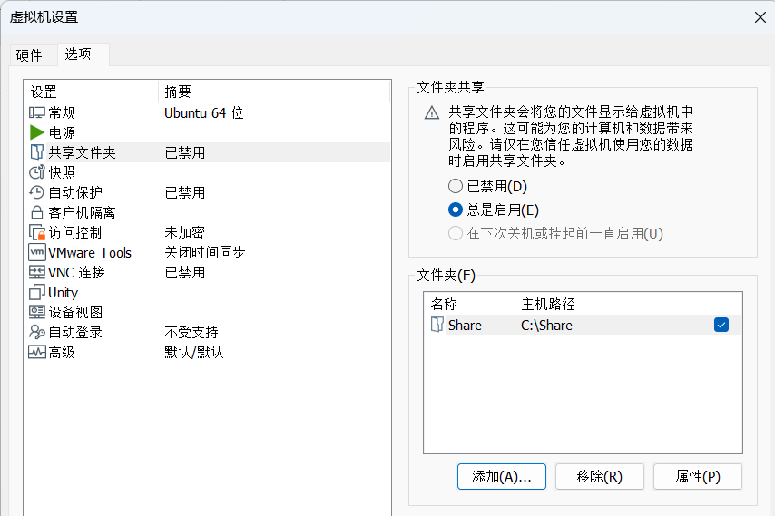

# Linux 和 Windows 交互

## Ubuntu 和 Windows 文件互传 

Windows 和 Ubuntu 下的文件互传我们需要使用 FTP 服务

### 开启 Ubuntu 下的 FTP 服务

在 **Ubuntu** 下开启 FTP 服务的标准做法是使用轻量级 FTP 服务器软件，比如 **vsftpd**（Very Secure FTP Daemon）。

* 安装 FTP 服务端
  
  ```bash
  sudo apt update
  sudo apt install vsftpd
  ```

* 检查状态

  ```bash
  sudo systemctl status vsftpd
  ```
  

### Windows 下 FTP 客户端安装

FileZilla 是一个非常经典、跨平台的 **FTP / SFTP / FTPS 客户端工具**，它的目标很简单：让你像用资源管理器一样在两台电脑之间拖拽文件。

去官网下载最新版：<https://filezilla-project.org/>

* **文件-> 站点管理器**


* **创建的“Ubuntu”站点，然后对站点进行设置**


* 如果要将 Windows 下的文件或文件夹拷贝到 Ubuntu 中，只需要在 Windows 区域选中要拷贝的文件或者文件夹，然后直接拖到右侧的 Ubuntu 中指定的目录即可。 将 Ubuntu 中的文件或者文件夹拷贝到 Windows 中也是直接拖放。

## Ubuntu 和 Windows 文件本地共享

* **安装 VMware Tools**

> 在现代 Ubuntu 中，通常已经预装了 **Open VM Tools**。
>
> ```bash
> dpkg -l | grep open-vm-tools
> ```
>
> 有输出，说明已经安装。

安装基本组件

```bash
sudo apt update
sudo apt install open-vm-tools open-vm-tools-desktop -y
```

检查是否启动

```bash
systemctl status open-vm-tools
```

* **在 VMware 设置共享文件夹**
  * **虚拟机关闭状态下，Options → Shared Folders 点击 Always enabled**




* **在 Ubuntu 中访问共享文件夹**
  * 启动 Ubuntu 虚拟机后，共享文件夹通常挂载在 `/mnt/hgfs/<共享文件夹名>`

> 即使安装了 VMware Tools，某些 Ubuntu 版本不会自动挂载共享文件夹，需要手动操作。
>
> * 创建挂载目录：
>
> ```bash
> sudo mkdir -p /mnt/hgfs
> ```
>
> * 挂载共享文件夹：
>
> ```bash
> sudo vmhgfs-fuse .host:/ /mnt/hgfs -o allow_other
> ```
>
> 如果想每次开机自动挂载：
>
> * 编辑 `/etc/fstab`：
>
> ```bash
> sudo nano /etc/fstab
> ```
>
> * 添加一行：
>
> ```bash
> .host:/  /mnt/hgfs  fuse.vmhgfs-fuse  allow_other  0  0
> ```
>
> * 保存后执行：
>
> ```bash
> sudo mount -a
> ```

## Ubuntu 系统搭建 tftp 服务器

**TFTP 服务器**（Trivial File Transfer Protocol，轻量文件传输协议）通常用于嵌入式开发、固件烧录或启动镜像传输。它非常轻量，但不提供安全验证，所以通常只在局域网内部使用。

* **安装 TFTP 服务器**

  ```bash
  sudo apt update
  sudo apt install tftpd-hpa
  ```

* **配置 TFTP 服务器**

  编辑配置文件：

  ```bash
  sudo nano /etc/default/tftpd-hpa
  ```

  示例配置：

  ```bash
  TFTP_USERNAME="tftp"
  TFTP_DIRECTORY="/tftpboot"
  TFTP_ADDRESS=":69"
  TFTP_OPTIONS="--secure --create"
  ```

* **设置 TFTP 根目录权限**

  ```bash
  sudo mkdir -p /tftpboot
  sudo chown -R tftp:tftp /tftpboot
  sudo chmod -R 777 /tftpboot
  ```

* **启动 TFTP 服务**

  ```bash
  sudo systemctl enable tftpd-hpa
  sudo systemctl restart tftpd-hpa
  ```

  > 检查状态：
  >
  > ```bash
  > sudo systemctl status tftpd-hpa
  > ```
  >
  >
  > 输出应显示 active (running)。

## Ubuntu 系统开启 NFS 和 SSH 服务

### 开启 NFS 服务

NFS（Network File System）允许多台设备共享同一个文件夹，例如开发板从 Ubuntu 下载镜像或配置文件。

* **安装 NFS 服务端**

  ```bash
  sudo apt install nfs-kernel-server
  ```

* **创建共享目录**

  ```bash
  sudo mkdir -p /nfsroot
  sudo chmod 777 /nfsroot
  ```

* **编辑 NFS 配置文件**

  ```bash
  sudo nano /etc/exports
  ```

  在文件末尾添加：

    ```bash
    /nfsroot *(rw,sync,no_root_squash,no_subtree_check)
    ```
  
  解释：
  
  * `*`：允许任意主机访问（测试方便）
  * `rw`：可读写
  * `sync`：写操作立即同步到磁盘
  * `no_root_squash`：客户端以 root 身份访问时保持 root 权限
  * `no_subtree_check`：加快访问速度
  
  > 实际开发时，可以用更安全的写法，比如只允许局域网：
  >
  > ```bash
  > /nfsroot 192.168.93.0/24(rw,sync,no_root_squash,no_subtree_check)
  > ```

* **更新导出表并启动服务**

  ```bash
  sudo exportfs -a
  sudo systemctl restart nfs-kernel-server
  ```

* **验证是否生效**

  查看当前共享目录：

  ```bash
  sudo exportfs -v
  ```

  输出类似：

  ```bash
  /nfsroot
          <world>(rw,wdelay,no_root_squash,no_subtree_check)
  ```

  > 在本机测试挂载（模拟客户端）：
  >
  > ```bash
  > sudo mount -t nfs localhost:/nfsroot /mnt
  > ```

### 开启 SSH 服务

SSH （Secure Shell）让你能从 Windows（或其他主机）远程登录 Ubuntu。

* **安装 SSH 服务端**

  ```bash 
  sudo apt update
  sudo apt install openssh-server
  ```

* **启动并设置为开机自启**

  ```bash
  sudo systemctl enable ssh
  sudo systemctl start ssh
  ```

* **检查 SSH 状态**

  ```bash
  sudo systemctl status ssh
  ```

* **查看 Ubuntu 的 IP 地址**

  ```bash
  ip addr show
  ```

  找到像 `192.168.x.x` 这样的地址（通常在 `eth0` 或 `ens33` 下）。

  > 之后你可以从 Windows 用 **Xshell、PuTTY 或 PowerShell** 登录：
  >
  > ```powershell
  > ssh 用户名@192.168.x.x
  > ```
  >
  > 比如：
  >
  > ```powershell
  > ssh angelina@192.168.1.102
  > ```

* **生成 SSH 密钥**

  ```powershell
  ssh-keygen -t rsa -b 4096
  ```

  > **结果：** 生成后，在默认路径下会有两个文件：
  >
  > * `id_rsa`: **私钥**（Private Key），**必须保密**。
  > * `id_rsa.pub`: **公钥**（Public Key），可以安全地分享给服务器

* **将公钥传输到 Ubuntu 服务器**

  * **`Linux`**

    ```bash
    ssh-copy-id -i C:\Users\Angelina_Smith\.ssh\id_rsa.pub angelina@192.168.1.102
    ```

  * **`Windows`**

    ```powershell
    type C:\Users\Angelina_Smith\.ssh\id_rsa.pub | ssh angelina@192.168.1.102 "mkdir -p ~/.ssh && cat >> ~/.ssh/authorized_keys"
    ```

* **修改 SSH 配置文件**

  ```powershell
  code C:\Users\Angelina_Smith\.ssh\config
  ```

* **添加您的别名配置**

  ```powershell
  Host angelina_wsl
      HostName localhost
      User angelina
      Port 22
      IdentityFile ~/.ssh/id_rsa
      ForwardAgent yes # 如果您没有为私钥设置密码 (passphrase)，可以跳过
  ```

* **测试连接**

  ```powershell
  ssh angelina_wsl
  ```

### SCP 文件传输

SCP 是一种基于 **SSH (Secure Shell)** 协议的文件传输方式。这意味着它提供了与 SSH 相同的 **安全性**、**认证** 和 **加密** 机制。

SCP 命令的基本格式是：`scp [opt] [src] [dir]`。

* **从本地复制到远程主机**

  ```bash
  scp ~/Documents/report.pdf angelina_wsl:/tmp/
  ```

* **从远程主机复制到本地**

  ```bash
  scp angelina_wsl:~/backup.zip ~/Downloads/
  ```

* **复制文件夹 (递归)**

  ```bash
  scp -r [opt] [src] [dir]
  ```

### 内网穿透

