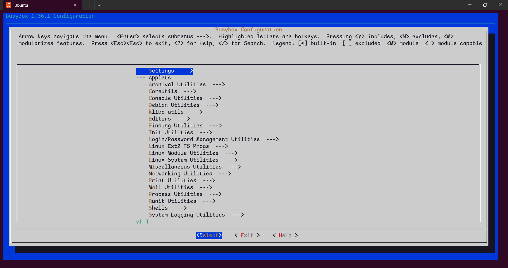

# Linux 文件系统

## 什么是 Linux 文件系统？

**文件系统（File System）** 是操作系统用于 **组织、管理和存储数据** 的一种结构。
 简单来说，它规定了：

- 文件数据 **如何存储在磁盘上**；
- 文件 **如何命名与访问**；
- 文件之间 **层次结构（目录树）** 的组织方式。

在 Linux 中，一切皆文件（Everything is a file）：

> 硬盘、键盘、进程、设备驱动等都以文件的形式存在。

## Linux 文件分类

- **Linux 系统中的文件可分为以下几大类：**

| 文件类型                          | 类型符号 | 说明                                            |
| --------------------------------- | -------- | ----------------------------------------------- |
| **普通文件（Regular File）**      | `-`      | 存放实际数据的文件，如文本、程序、图片、视频等  |
| **目录文件（Directory File）**    | `d`      | 存放文件名与 `inode` 号对应关系，相当于“文件夹” |
| **符号链接文件（Symbolic Link）** | `l`      | 指向其他文件的“快捷方式”                        |
| **设备文件（Device File）**       | `c` `d`  | 表示硬件设备，位于 `/dev` 目录下                |
| **管道文件（Named Pipe / FIFO）** | `p`      | 用于进程间通信的特殊文件                        |
| **套接字文件（Socket File）**     | `s`      | 网络或本地通信接口文件                          |

- **设备文件分类：**

| 类型                             | 描述                             | 示例                       |
| -------------------------------- | -------------------------------- | -------------------------- |
| **字符设备（Character Device）** | 按字符流访问设备（如串口、终端） | `/dev/tty`, `/dev/serial0` |
| **块设备（Block Device）**       | 按块访问设备（如硬盘、U 盘）      | `/dev/sda`, `/dev/mmcblk0` |

## Linux 目录结构

Linux 采用 **树形目录结构（Tree Hierarchical Structure）**， 所有文件和目录都挂载在一个唯一的根目录 `/` 下。

> “一切皆文件”，从硬盘到外设都在 `/` 下有对应的文件或目录。

- **顶层目录一览表**

| 目录          | 全称/含义                 | 主要内容                                              |
| ------------- | ------------------------- | ----------------------------------------------------- |
| `/`           | **Root 根目录**           | 整个文件系统的起点                                    |
| `/bin`        | **Binary**                | 存放基本命令（二进制可执行文件），如 `ls`, `cp`, `mv` |
| `/sbin`       | **System Binary**         | 系统管理员使用的命令，如 `reboot`, `ifconfig`         |
| `/boot`       | **Boot Loader**           | 启动相关文件（内核 `vmlinuz`、引导加载器 `grub`）     |
| `/dev`        | **Device**                | 设备文件（硬盘、U 盘、终端等），如 `/dev/sda`          |
| `/etc`        | **Et Cetera（系统配置）** | 系统与服务配置文件（如 `/etc/passwd`, `/etc/fstab`）  |
| `/home`       | **User Home**             | 普通用户的主目录（如 `/home/angelina`）               |
| `/lib`        | **Library**               | 系统程序运行所需的共享库文件                          |
| `/lib64`      | **Library (64-bit)**      | 64 位系统的库文件目录                                  |
| `/media`      | **Removable Media**       | 外部设备的自动挂载点（U 盘、光驱）                     |
| `/mnt`        | **Mount**                 | 临时挂载点（管理员手动挂载用）                        |
| `/opt`        | **Optional**              | 第三方软件的安装目录（如 `/opt/google/chrome`）       |
| `/proc`       | **Process Info**          | 内核和进程的虚拟文件系统（如 `/proc/cpuinfo`）        |
| `/root`       | **Root Home**             | 超级用户（`root`）的主目录                            |
| `/run`        | **Runtime Data**          | 存放系统运行时数据（`PID` 文件、`Socket` 文件）       |
| `/srv`        | **Service Data**          | 系统服务数据（如 `FTP`、`Web` 服务器文件）            |
| `/sys`        | **System Info**           | 内核、设备驱动信息（虚拟文件系统）                    |
| `/tmp`        | **Temporary**             | 临时文件目录，系统重启后会清空                        |
| `/usr`        | **Unix System Resources** | 用户级程序与资源                                      |
| `/var`        | **Variable**              | 可变数据，如日志、缓存、邮件队列等                    |
| `/lost+found` | **lost+found**            | 存放文件系统在崩溃或修复（fsck）时找回的“孤立文件”    |

- **`/usr` 的目录结构与作用**

| 子目录         | 含义                                      |
| -------------- | ----------------------------------------- |
| `/usr/bin`     | 用户级命令（例如 `gcc`, `vim`, `python`） |
| `/usr/sbin`    | 管理员命令（例如 `apachectl`, `sshd`）    |
| `/usr/lib`     | 对应的库文件                              |
| `/usr/include` | C 语言头文件                               |
| `/usr/share`   | 共享的只读数据（帮助文档、图标、字体）    |
| `/usr/local`   | 用户自行安装的软件（与系统包分离）        |

- **`/etc` 的目录结构与作用**

| 子目录 / 文件                       | 说明                                              |
| ----------------------------------- | ------------------------------------------------- |
| `/etc/passwd`                       | 用户账户信息（用户名、`UID`、主目录、`shell` 等） |
| `/etc/shadow`                       | 用户密码信息（加密存储）                          |
| `/etc/group`                        | 用户组信息                                        |
| `/etc/fstab`                        | 系统启动时自动挂载的文件系统配置                  |
| `/etc/hostname`                     | 当前主机名                                        |
| `/etc/hosts`                        | 本地 `DNS` 解析（主机名与 IP 对应关系）           |
| `/etc/resolv.conf`                  | `DNS` 服务器配置                                  |
| `/etc/network/`                     | 网络接口配置（部分发行版）                        |
| `/etc/systemd/`                     | systemd 服务与启动单元配置目录                    |
| `/etc/init.d/`                      | 旧式 System V 启动脚本（服务启动、停止脚本）      |
| `/etc/profile`                      | 系统级环境变量配置脚本                            |
| `/etc/bashrc` 或 `/etc/bash.bashrc` | 全局 Bash shell 启动脚本                          |
| `/etc/skel/`                        | 新用户创建时的默认文件模板                        |
| `/etc/cron.d/`, `/etc/cron.daily/`  | 定时任务脚本存放处                                |
| `/etc/sudoers`                      | sudo 权限配置文件（必须用 `visudo` 编辑）         |
| `/etc/ssh/`                         | SSH 服务相关配置（如 `sshd_config`）              |
| `/etc/X11/`                         | 图形界面（X Window System）配置                   |
| `/etc/apt/`                         | `Ubuntu`/`Debian` 软件源与包管理配置              |
| `/etc/yum.conf` / `/etc/dnf/`       | `RHEL`/`Fedora` 系列软件包管理配置                |
| `/etc/selinux/`                     | `SELinux` 安全策略配置                            |
| `/etc/sysctl.conf`                  | 内核参数配置（如网络缓冲、进程限制）              |

- **`/dev` 的目录结构与作用**

| 项目 / 示例                            | 主要作用                     |
| -------------------------------------- | ----------------------------|
| `/dev/block/` | 块设备信息（硬盘、U 盘等）|
| `/dev/char/`  | 字符设备信息（键盘、终端、随机数等）|
| `/dev/disk/`  | 磁盘及分区管理|
| `/dev/bus/` | 显示系统硬件总线设备结构 |
|`/dev/mapper/`      | 逻辑卷、加密卷映射目录|
| `/dev/sd*`                             | 实体磁盘及分区               |
| `/dev/ram*` | RAM Disk（内存模拟磁盘） |
| `/dev/tty*`                            | 虚拟终端设备（控制台)    |
| `/dev/ttyS*` | 串行端口（Serial Port） |
|`/dev/ttyAMA*`|`ARM` `SoC` 内置 `UART`|
| `/dev/loop*`                           | 虚拟磁盘（挂载 ISO、snap 包）  |
| `/dev/cdrom` `/dev/sr*` | 光驱文件 |
| `/dev/console` | 系统主控制台输出 |
| `/dev/null`                            | “黑洞”设备，丢弃写入数据     |
| `/dev/zero`                            | 输出连续的零值（`0x00`）     |
| `/dev/random` / `/dev/urandom`         | 提供随机数源                 |
| `/dev/fd`、`/dev/stdin`、`/dev/stdout` | 文件描述符与标准输入输出接口 |
| `/dev/kmsg`                            | 内核日志接口（`dmesg` 使用） |
| `/dev/kvm`                             | 虚拟机加速接口（`KVM`）      |
| `/dev/fuse`                            | 用户空间文件系统接口         |
| `/dev/log`                             | 系统日志接口                 |
| `/dev/rtc0`                            | 实时时钟设备                 |

## 文件系统类型

Linux 支持多种文件系统格式，不同格式在性能与功能上有所差异。

> **磁盘文件系统**
>
> `Ext`（Extended File System）
>
> `FAT`（File Allocation Table）
>
> `NTFS`（New Technology File System）
>
> **网络文件系统**
>
> `NFS`（Network File System）
>
> **虚拟文件系统**
>
> `VFS`（Virtual File System）

| 文件系统类型                   | 特点                                                |
| ------------------------------ | --------------------------------------------------- |
| **`ext2`**                     | 早期 Linux 默认文件系统，无日志功能                 |
| **`ext3`**                     | ext2 的改进版，加入日志功能（journaling）提高可靠性 |
| **`ext4`**                     | 当前主流，支持大文件、性能高、稳定                  |
| **`XFS`**                      | 高性能文件系统，适合大文件存储                      |
| **`Btrfs`**                    | 新一代文件系统，支持快照、压缩、子卷等高级功能      |
| **`FAT32` / `exFAT` / `NTFS`** | 与 Windows 兼容的文件系统，用于 U 盘或双系统          |

## **文件系统的基本层次**

Linux 文件系统主要分为 **四层结构**：

### 用户空间层（User Space）

- 位置：应用程序层

- 功能：

  - 应用程序通过系统调用访问文件，如 `open()`, `read()`, `write()`, `close()`
  - 用户无需直接了解底层磁盘细节

- 例子：

  ```bash
  cat file.txt
  ```

  ```bash
  vim /etc/fstab
  ```

### 虚拟文件系统层（VFS, Virtual File System）

- 位置：内核空间
- 功能：
  - 提供统一的 **文件系统接口**，屏蔽具体文件系统差异
  - 管理 **文件描述符、inode、超级块** 等数据结构
  - 调用对应具体文件系统的驱动执行操作
- 特点：
  - `VFS` 是 `Linux` 内核支持 **多种文件系统的关键接口层**
  - 支持 **块设备和字符设备统一访问**

### 文件系统驱动层（File System Drivers）

- 功能：
  - 提供对具体文件系统的实现（如 `ext4`, `XFS`, `Btrfs`, `FAT`）
  - 实现文件读写、目录操作、权限检查、日志处理等功能
- 特点：
  - 每种文件系统都有对应的驱动模块
  - 驱动负责解析 `inode`、数据块映射、日志等

### 块设备层（Block Device Layer）

- 功能：
  - 负责管理物理存储设备，如硬盘、`SSD`、光驱、U 盘
  - 提供对设备的块读写接口
- 特点：
  - Linux 使用 `/dev/sd*`, `/dev/loop*`, `/dev/ram*` 等设备文件访问
  - 支持缓冲（Buffer Cache）来提高性能

## 使用 `BusyBox` 制作根文件系统

### 什么是 `BusyBox`

- **`BusyBox`** 被称为 “Linux 的瑞士军刀”
- 集成了 **多种 Unix 命令**（如 `ls`, `cp`, `sh` 等）于一个可执行文件
- 体积小、适合嵌入式系统或最小 Linux 系统
- 支持配置哪些命令被编译进去

### 准备环境

你需要一台 Linux 主机（`Ubuntu` / `Debian` / `CentOS` 等）：

```bash
sudo apt update
sudo apt install build-essential libncurses5-dev bc git wget
```

必要工具说明：

- `build-essential` → 编译器工具链
- `libncurses5-dev` → `BusyBox` 配置界面依赖
- `git/wget` → 下载源码

### 下载 `BusyBox` 源码

```bash
wget https://busybox.net/downloads/busybox-1.36.1.tar.bz2
tar xjf busybox-1.36.1.tar.bz2
cd busybox-1.36.1
```

### 配置 BusyBox

#### 使用默认配置

```bash
make defconfig
```

#### 自定义配置

```bash
make menuconfig
```



- 在菜单中，你可以选择：
  - **编译的命令工具**（`ls`, `cp`, `mount`, `vi`, `sh` 等）
  - **安装路径**（通常使用 `/usr` 或 `/bin`）
  - **是否启用静态编译**（建议嵌入式系统用 `yes`，避免依赖 `libc`）

> 静态编译示例
>
> ```bash
> make menuconfig
> # -> BusyBox Settings -> Build Options -> Build BusyBox as static binary -> Yes
> ```

### 编译 `BusyBox`

```bash
make -j$(nproc)
make install CONFIG_PREFIX=../rootfs
```

- `CONFIG_PREFIX` 指定安装路径，这里我们创建了一个 `rootfs` 目录
- 编译后，`rootfs` 就包含 `BusyBox` 可执行文件和基本目录结构

### 添加标准目录

即使 `BusyBox` 已经创建了一些目录，通常还需要手动添加标准 Linux 目录：

```bash
cd ../rootfs
mkdir -p {dev,etc,proc,sys,usr,bin,sbin,tmp,root,lib,home,mnt}
chmod 755 tmp
```

- `/dev` → 设备文件（可用 `mknod` 或 `tmpfs` 挂载）
- `/proc`、`/sys` → 虚拟文件系统挂载点
- `/etc` → 配置文件（如 `passwd`, `group`, `fstab`）
- `/bin`, `/sbin`, `/usr/bin`, `/usr/sbin` → `BusyBox` 工具存放

### 创建必要的设备节点

```bash
cd dev
sudo mknod console c 5 1
sudo mknod null c 1 3
```

- `console` → 系统控制台
- `null` → 空设备

### 添加初始化脚本 (init)

创建 `init` 文件（必须在根目录 `/`）：

```bash
cd /rootfs
vim init
```

填入以下内容

```init
#!/bin/sh
mount -t proc proc /proc
mount -t sysfs sysfs /sys
echo "Welcome to Minimal Linux"
exec /bin/sh
```

- 给权限：

```bash
chmod +x init
```

- `init` 是 Linux 启动的第一个进程（`PID 1`）

### 打包为镜像

```bash
cd ..
sudo chown -R root:root rootfs
find rootfs | cpio -H newc -o > rootfs.cpio
gzip rootfs.cpio
```

> **cpio = "copy in/out"** 的缩写，是 Linux/Unix 系统中一种 **归档文件格式**，类似 tar。
>
> | 名称            | 格式                      | 特点                     | 使用方式        |
> | --------------- | ------------------------- | ------------------------ | --------------- |
> | **`initrd`**    | 磁盘镜像（`ext2`/`ext3`） | 需要挂载后 `pivot_root`  | 老旧内核方式    |
> | **`initramfs`** | `cpio` 压缩包             | 直接解压到内存，无需挂载 | Linux 2.6+ 推荐 |

- 输出文件：`rootfs.cpio.gz`
- 可用于 `QEMU` 启动或写入嵌入式设备


