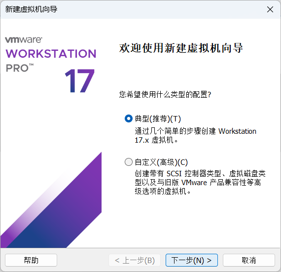
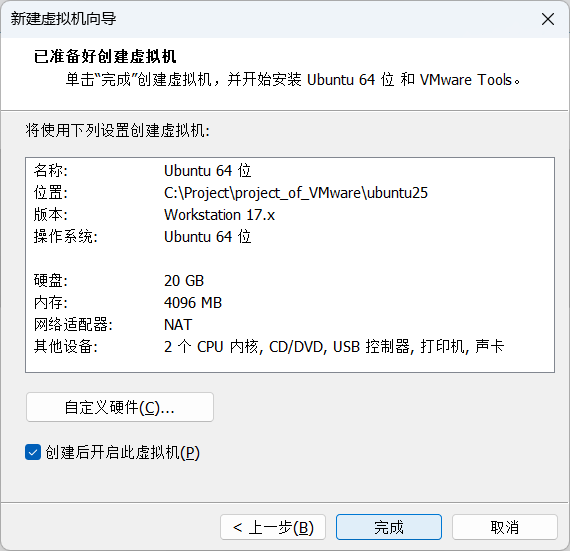
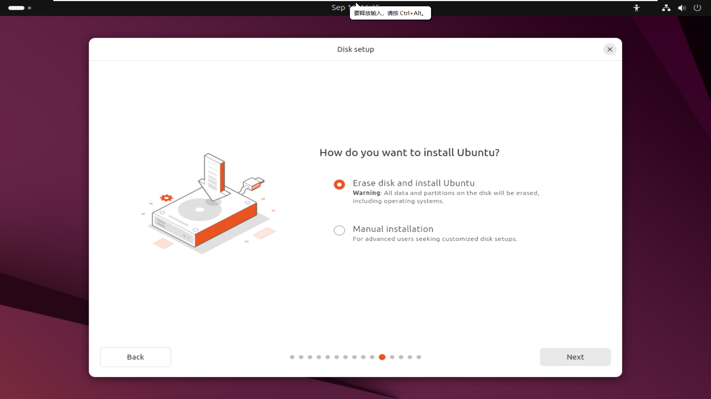
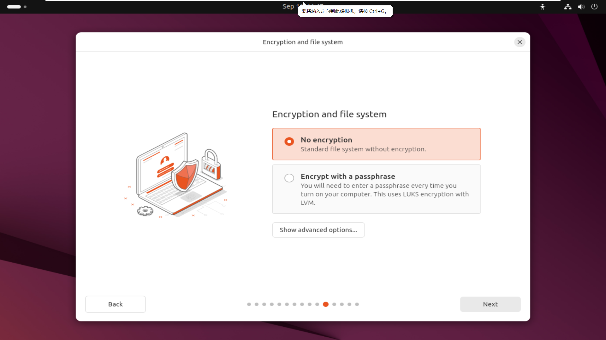
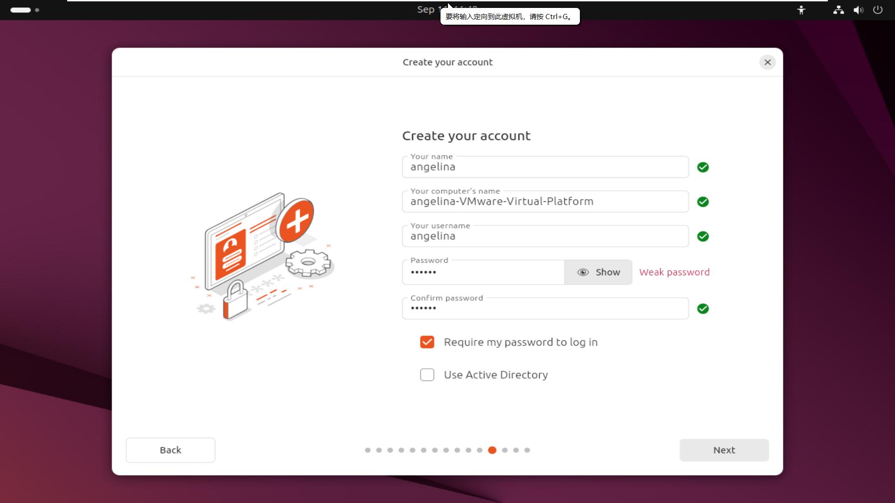
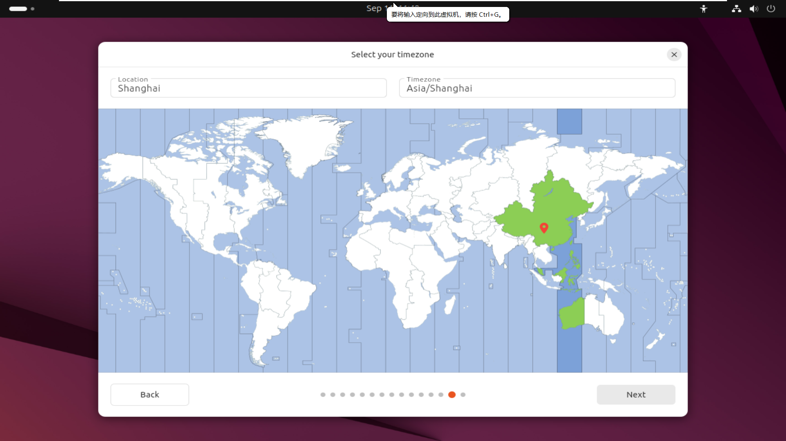
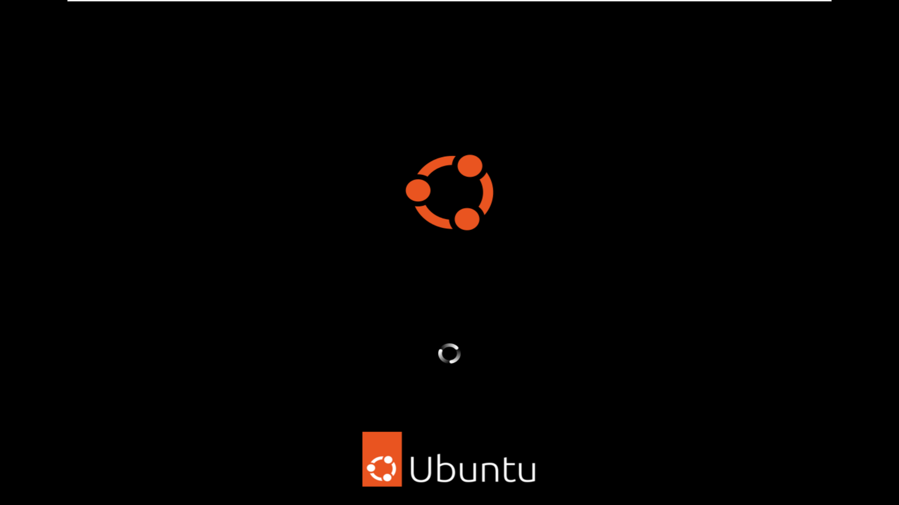

# Linux系统安装

## 什么是Linux系统？

`Linux` 其实就是“操作系统家族”里的一个大门派。我们平常用的 `Windows`、`macOS` 也是操作系统——它们的任务是调度硬件（CPU、内存、硬盘）并给你提供一个环境去跑应用软件。

### Linux 的来头

1991 年，芬兰学生 **Linus Torvalds** 在 Minix 系统的启发下写了一个内核（内核 = 操作系统的大脑），并免费发布到网上。因为它是 **开源** 的，全球的程序员都能贡献代码，所以它像滚雪球一样越变越强大。

现在说“Linux”，通常指的是：

- **Linux 内核**（真正的系统内核）。
- **Linux 发行版**（kernel + 工具 + 软件组合），比如 `Ubuntu`、`Debian`、`Fedora`、`Arch Linux`、`CentOS` 等。

### Linux 的特点

- **开源自由**：代码公开，任何人都能修改、再分发。
- **跨平台**：能跑在手机（`Android` 就是基于 `Linux`）、服务器、超级计算机，甚至冰箱和路由器上。
- **安全稳定**：权限管理严格、社区修复快，所以服务器领域大量使用。
- **多样化**：发行版繁多，不同风格、用途各异。
- **社区驱动**：没有微软或苹果那样的单一“大老板”，而是全球程序员共同推动。

### Linux 在哪用？

- **服务器领域**：互联网上超过 90% 的服务器跑的是 `Linux`（比如 `Google`、`Facebook`、亚马逊）。
- **超级计算机**：全球前 500 台超级计算机几乎全用 `Linux`。
- **开发环境**：程序员喜欢 `Linux`，因为命令行强大、工具齐全。
- **日常桌面**：虽然市场份额小，但 `Ubuntu`、`Linux Mint` 等发行版已经很适合普通用户。
- **嵌入式设备**：手机（`Android`）、智能电视、路由器、物联网设备里都有它的影子。

## 如何安装Linux系统？

> 因为我们平常工作和生活的操作系统是 Windows，很多人不是直接“换掉” Windows，而是选择在 Windows 电脑上额外装 Linux。此外Linux还有许多优势：
>
> **学习与开发**
>
> - Linux 是计算机、电子信息、人工智能、服务器等领域的主力系统。
> - 许多课程和工具（如 `gcc`、`make`、`ROS`、`Docker`）在 Linux 下更原生。
>
> **编程与科研环境**
>
> - Linux 自带强大的命令行工具，包管理器 apt/yum 让安装软件方便快捷。
> - 很多科研库（`TensorFlow`、`PyTorch`）在 Linux 下安装更顺畅。
>
> **稳定与安全**
>
> - Linux 系统开放、稳定，病毒少，服务器领域几乎都用 Linux。
>
> **灵活与自由**
>
> - 免费开源，系统可高度定制。
> - 发行版选择丰富，可以挑选最适合自己需求的版本。

### 虚拟机（Virtual Machine）安装Linux

在 Windows 上用 `VirtualBox`、`VMware`、`Hyper-V` 之类的软件，新建一台“虚拟电脑”，再在里面装 Linux 系统。

- **原理**：虚拟化技术在 Windows 上模拟一台完整的硬件，Linux 就像住在这台“假硬件”的房子里。
- **优点**：
  - 安全，不会改动实际硬盘分区。
  - 可随时开关、拍快照（保存某一时刻的状态，随时回退）。
  - 可以体验完整的 Linux 桌面环境。
- **缺点**：
  - 占用资源大（CPU、内存、硬盘），性能损失明显。
  - 图形/3D 性能差，跑游戏、机器学习这类对 `GPU` 要求高的应用会卡。

适合：新手想完整体验 Linux 桌面，或者课程实验、轻量开发。

> 安装`VMware`虚拟机可以参考这篇帖子：
>
> [2025最新vmware-17虚拟机安装教程（保姆级，图文讲解，带安装包）_vmware17-CSDN博客](https://blog.csdn.net/l827893628/article/details/147743532)

- 安装后打开`VMware`

- 新建虚拟机

- 安装系统光盘映像文件

> `Ubuntu`光盘映像文件下载地址：
>
> [Index of /ubuntu-releases/ | 清华大学开源软件镜像站 | Tsinghua Open Source Mirror](https://mirrors.tuna.tsinghua.edu.cn/ubuntu-releases/)

- 简易安装信息

- 命名虚拟机

- 指定磁盘容量

- 创建虚拟机

- **当当，Welcome to Ubuntu**

- **测试一下**

### Windows Subsystem for Linux（WSL/WSL2）安装Linux

这是 Windows 10/11 自带的“Linux 子系统”，直接在 Windows 上安装。

- **原理**：
  - `WSL1`：把 Linux 系统调用翻译成 Windows 系统调用（性能有限）。
  - `WSL2`：直接运行一个轻量虚拟机，里面是完整 Linux 内核，性能和兼容性更好。
- **优点**：
  - 无需双系统或大虚拟机，安装简单（`wsl --install` 就能装）。
  - 跟 Windows 整合度高，可以在 Windows 终端里直接跑 Linux 命令。
  - 支持 Docker（WSL2 内核能跑容器）。
- **缺点**：
  - 桌面图形体验有限，虽然现在支持 GUI 应用了，但还是不如原生流畅。
  - 更适合命令行环境，而不是完整 Linux 桌面体验。

适合：开发者、学生，尤其是写代码、用命令行工具、跑服务器环境的人。

> [Windows 11 上轻松安装 WSL，实现秒开 Linux 开发环境！-腾讯云开发者社区-腾讯云](https://cloud.tencent.com/developer/article/2539992)

- 效果

### Docker 安装 Linux

Docker 和虚拟机有点像，但更轻量。它不是跑一个完整的“虚拟电脑”，而是在共享宿主机内核的基础上，用 **容器（Container）** 来隔离环境。

- **原理**：Docker 容器共享宿主机（这里是 Windows + WSL2）的内核，但在用户看来像是一个独立的 Linux 环境。
- **优点**：
  - 启动快（几秒就能拉起一个容器）。
  - 占用资源少，适合同时运行多个 Linux 环境。
  - 方便打包和分发，比如 `docker run ubuntu` 就能快速得到一个 Ubuntu 环境。
- **缺点**：
  - 容器里的 Linux 不是完整的桌面系统，更适合命令行、服务端应用。
  - 在 Windows 上运行 Docker，需要 `WSL2` 或虚拟机做支撑。
- **应用场景**：
  - 软件开发、测试环境。
  - 快速切换不同版本的 Linux 或软件。
  - 部署服务（网站、数据库、AI 框架等）。

> [Docker 安装 Ubuntu | 菜鸟教程](https://www.runoob.com/docker/docker-install-ubuntu.html)
