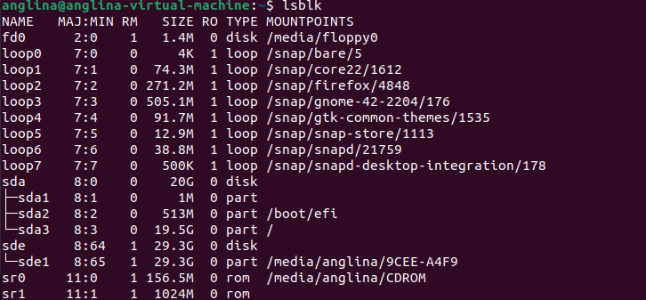
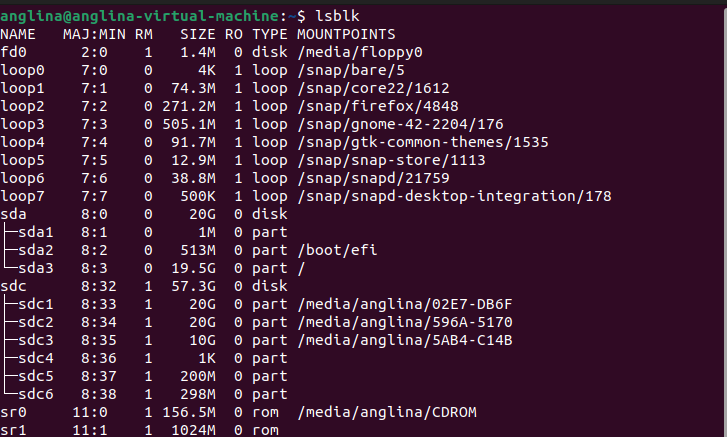

# Shell 常见命令

## 什么是 Shell

在 **Linux** 里，Shell 指的就是 **命令行解释器**。它是用户和 Linux 内核之间的中介，你敲的命令全都要经过 Shell 来解释。

> **Linux 下常见的 Shell**
> 
> * **bash** (Bourne Again Shell) → 最常见，Ubuntu、CentOS 默认
> 
> * **sh** (Bourne Shell) → 很古老，但很多脚本默认用它
> 
> * **zsh** → 强大、可定制，搭配 oh-my-zsh 特别流行
> 
> * **fish** → 新一代 Shell，交互体验好

## Shell 的命令

### Shell 的命令提示符

在 **Linux** 里，命令提示符就是你在终端里看到的那一行“等待你输入命令的符号/文字”。
它是 **Shell 提供的交互入口**。

* 普通用户：

  ```bash
  angelina@ubuntu:~$ 
  ```

  末尾是 `$`

* 超级用户（root）：

  ```bash
  root@ubuntu:/# 
  ```

  末尾是 `#`

这个小小的符号 `$` 或 `#` 就是区分普通用户和 root 的直观标志。

### Shell 的命令格式

在 **Linux Shell** 里，命令的基本格式其实很规整，可以拆成几块：

```bash
命令  [选项]  [参数]
```


> **命令 (command)**

要执行的程序或内置指令，比如：

* `ls` → 列出文件
* `cp` → 拷贝文件
* `echo` → 打印内容

> **选项 (option)**

用来修改命令的行为，通常以 `-` 或 `--` 开头：

* `ls -l` → 详细列表（long format）
* `ls -a` → 显示隐藏文件（all）
* `ls -la` → 可以组合使用
* `ls --help` → GNU 风格的长选项

> **参数 (argument)**

命令要操作的对象（文件名、路径、字符串…）：

* `ls /home/angelica` → 列出目录 `/home/angelica`
* `cp a.txt b.txt` → 把 `a.txt` 复制为 `b.txt`

> **其他用法**

除了最基本的三块，Shell 命令还能用：

* **管道 `|`**：把前一个命令的输出作为后一个命令的输入

  ```bash
  ls -l | grep "txt"
  ```

  → 列出文件，并筛选出 `.txt` 文件

* **重定向 `>` `<` `>>`**：把输出写入文件

  ```bash
  echo "Hello" > file.txt   # 覆盖写
  echo "World" >> file.txt  # 追加写
  ```

* **命令替换**：用 ``...`` 或 `$(...)` 把一个命令的结果作为参数

  ```bash
  echo "Today is $(date)"
  ```

## 常用命令

### 常用命令

* **`echo`**：在终端中显示文本或变量的值。

    ```bash
    echo "Hello, World!"
    ```

* **`pwd`**（print working directory）：显示当前所在目录

    ```bash
    pwd 
    ```

* **`ls`**（list）：列出目录内容

  ```bash
  ls
  # ll
  ```

  * `ls` → 简单列出
  * `ls -l` → 显示详细信息（权限、大小、时间）
  * `ls -a` → 显示隐藏文件（以 `.` 开头的文件）
  * `ls -lh` → 文件大小以易读的方式显示（K/M/G）

* **`cd`**（change directory）：切换目录

    ```bash
    cd /etc
    cd ~        # 回到 home
    cd ..       # 返回上一级目录
    cd -        # 回到上次所在目录
    ```

* **`touch`**：创建空文件或更新文件时间戳

    ```bash
    touch file.txt          # 创建一个名为 file.txt 的空文件  
    touch file1 file2       # 同时创建多个文件  
    touch -c file.txt       # 如果文件不存在则不创建，只更新已有文件的时间戳  
    touch -t 202501010101 file.txt   # 指定时间戳（2025-01-01 01:01）  
    ```

-----

* **`mkdir`**（make directory）：新建目录

    ```bash
    mkdir test
    mkdir -p dir1/dir2/dir3   # 递归创建
    ```

* **`rmdir`**（remove directory）：删除空目录

    ```bash
    rmdir test
    ```

* **`rm`**（remove）：删除文件或目录

    ```bash
    rm file.txt           # 删除文件
    rm -r dir/            # 递归删除目录
    rm -rf dir/           # 强制删除（危险！）
    ```

-----

* **`cp`**（copy）：复制文件/目录

    ```bash
    cp a.txt b.txt        # 复制文件
    cp -r dir1 dir2       # 递归复制目录
    ```

* **`mv`**（move）：移动或重命名

    ```bash
    mv a.txt dir/         # 移动文件到目录
    mv old.txt new.txt    # 重命名文件
    ```

-----

* **`cat`**（catenate）：一次性显示整个文件

    ```bash
    cat file.txt          # 一次性打印整个文件内容（适合小文件）
    ```

* **`more` / `less`**：分页查看

    ```bash
    more file.txt         # 分页显示文件内容，按空格翻页，适合中等大小文件
    less file.txt         # 分页显示，支持上下翻页和搜索，功能比 more 强
    ```

-----

* **`find`**：按名字/类型/大小等条件搜索

    ```bash
    find /home -name "*.txt"   # 在 /home 目录下递归查找所有 .txt 文件
    find . -type d             # 在当前目录下查找所有目录（d = directory）
    find . -size +10M          # 查找大于 10MB 的文件
    ```

* **`grep`** (global regular expression) : 查找文件里符合条件的字符串或正则表达式

    ```bash
    grep hello file.txt # 在文件 file.txt 中查找字符串 "hello"
    ```

* **`file`**（文件类型识别）：判断指定文件的类型

    ```bash
    file example.txt                # 检测文件类型（文本、二进制、可执行文件等）
    file /bin/ls                    # 查看系统命令文件的类型
    file -i image.png               # 显示 MIME 类型（如 image/png）
    file *                          # 批量检测当前目录下所有文件类型
    ```

* **`cmp`**（文件内容比较）：逐字节比较两个文件的差异

    ```bash
    cmp file1.txt file2.txt         # 比较两个文件，若不同会显示首个差异位置
    cmp -l file1.txt file2.txt      # 以八进制形式显示不同字节及位置
    cmp -s file1.txt file2.txt      # 静默模式，不输出，只根据退出码判断是否不同
    cmp image1.png image2.png       # 可用于比较二进制文件（如图片）
    ```

* **`diff`**（difference）：逐行比较文件内容差异

    ```bash
    diff file1.txt file2.txt        # 比较两个文件，输出不同之处  
    diff -u file1.txt file2.txt     # 以统一格式显示差异（常用于补丁 patch）  
    diff -c file1.txt file2.txt     # 以上下文格式显示差异  
    diff -r dir1 dir2               # 递归比较两个目录  
    diff -q dir1 dir2               # 只显示目录/文件是否不同，不输出具体内容  
    ```

* **`alias`**：给命令或命令组合创建别名（简化操作或增加安全性）

    ```bash
    alias ll='ls -alF'              # 定义 ll 为 ls -alF
    alias la='ls -A'                # 定义 la 为 ls -A
    alias grep='grep --color=auto'  # 给 grep 输出加颜色
    alias cls='clear'               # 定义 cls 为清屏
    alias rm='rm -i'                # 删除前询问确认（防误删）
    ```

-----

* **`df`**（disk free）：显示文件系统的磁盘空间使用情况

    ```bash
    df                   # 显示所有文件系统的磁盘使用情况（单位为 KB）  
    df -h                # 以易读的方式显示（KB/MB/GB 自动换算）  
    df -T                # 显示文件系统类型（ext4、xfs 等）  
    df -i                # 显示 inode 使用情况  
    df /home             # 查看指定目录所在分区的磁盘使用情况  
    ```

* **`du`**（disk usage）：显示目录或文件占用的磁盘空间

    ```bash
    du                   # 显示当前目录及其子目录的空间占用（单位为 KB）  
    du -h                # 以易读的方式显示（KB/MB/GB 自动换算）  
    du -s                # 仅显示总占用空间（summary）  
    du -sh *             # 显示当前目录下各文件/文件夹的大小（常用）  
    du -h --max-depth=1  # 限制目录深度，只显示一级子目录大小  
    du -ah               # 显示所有文件和目录的大小  
    ```

* **`fdisk`**（format disk）：磁盘分区工具，用于查看、创建、删除和管理磁盘分区（需要 root 权限）

    ```bash
    sudo fdisk -l             # 列出系统中所有磁盘及分区信息  
    sudo fdisk /dev/sda       # 对指定磁盘（如 /dev/sda）进行分区操作  
    ```

* **`lsblk`**（list block devices）：列出系统中所有块设备的信息（如磁盘、分区、U 盘等）

    ```bash
    lsblk                                  # 显示所有块设备的层级结构  
    lsblk -f                               # 显示文件系统类型和标签等信息  
    lsblk -p                               # 显示设备的完整路径（如 /dev/sda1）  
    lsblk -o NAME,SIZE,FSTYPE,MOUNTPOINT   # 自定义输出列信息  
    lsblk -r                               # 以原始格式输出，适合脚本处理  
    lsblk -e7                              # 排除 loop 设备（例如排除虚拟块设备）  
    ```

* **`mount`**：将一个设备或分区挂载到文件系统中的某个目录下

    ```bash
    mount                  # 显示当前已挂载的设备和挂载点  
    sudo mount /dev/sdb1 /mnt         # 将分区 /dev/sdb1 挂载到 /mnt 目录  
    sudo mount -t ext4 /dev/sdb1 /mnt # 指定文件系统类型挂载（如 ext4）  
    sudo mount -o ro /dev/sdb1 /mnt   # 以只读模式挂载  
    sudo mount -o loop image.iso /mnt # 将 ISO 镜像文件挂载到目录  
    ```

* **`ln`**(link)：创建文件或目录的链接

    ```bash
    ln source.txt hardlink.txt            # 创建硬链接（硬链接共享 inode）
    ln -s /path/to/source.txt link.txt    # 创建符号链接（软链接，相当于快捷方式）
    ln -s ~/Desktop/zynq7020_prj ~/project_link  # 给目录创建符号链接
    ln -sf /usr/bin/python3 python         # 强制覆盖已有符号链接
    rm link.txt                            # 删除链接（符号链接或硬链接）
    ls -l                                  # 查看链接信息（符号链接会显示 -> 指向路径）
    ```

* **`file`**：查看文件类型的命令

    ```bash
    file filename.txt                     # 查看文件类型
    file /bin/ls                          # 查看可执行文件类型（如 ELF 可执行程序）
    file image.jpg                        # 查看图片类型及编码信息
    file -b filename                      # 只输出类型，不显示文件名
    file -i filename                      # 显示 MIME 类型（如 text/plain、image/png）
    file *                                # 查看当前目录下所有文件的类型
    file -L symlink                       # 跟随符号链接，查看目标文件类型
    file -z archive.gz                    # 查看压缩文件内文件类型
    ```


-----

* **`gzip`**(GNU zip)：对文件进行压缩和解压缩

    ```bash
    gzip file.txt		 # 压缩 file.txt
    gzip -d file.txt.gz  # 解压（等价于 gunzip file.txt.gz）
    ```

* **`tar`**(tape archive) ：对文件进行打包和解包

    ```bash
    tar -czvf a.tar.gz dir/    # 打包目录 dir 并压缩为 a.tar.gz
    tar -xzvf a.tar.gz         # 解压 a.tar.gz 到当前目录
    ```

* **`zip`/`unzip`**：压缩包/解压缩包

    ```bash
    zip myfile.zip file.txt							# 压缩单个文件
    zip myfiles.zip file1.txt file2.txt file3.txt	# 压缩多个文件
    zip -r myfolder.zip /path/to/folder				# 递归压缩整个目录
    unzip myfiles.zip								# 解压到当前目录
    unzip myfiles.zip -d /path/to/destination		# 解压到指定目录
    unzip -l myfiles.zip							# 列出压缩包内容而不解压
    ```

-----

* **`su`**(switch user)：切换用户身份的命令

    ```bash
    su              # 切换到root，保持当前环境
    su -            # 切换到root，加载root的完整环境
    su root         # 明确指定切换到root用户
    ```

* **`sudo`**（superuser do）：以超级用户或其他用户身份执行命令的工具

    ```bash
    sudo command              # 以root身份执行单条命令  
    sudo -u username command  # 以指定用户身份执行命令  
    sudo -i                   # 切换到root并加载root的登录环境  
    sudo -s                   # 切换到root但保留当前环境  
    ```

* **`adduser`**：创建新用户并为其设置环境的命令

    ```bash
    adduser username            # 创建新用户并自动创建主目录  
    adduser username groupname  # 创建新用户并将其添加到指定组  
    sudo adduser username       # 以管理员权限创建用户（普通用户需加sudo）
    ```

* **`deluser`**：删除用户账户的命令

    ```bash
    deluser username                 # 删除用户，但保留其主目录  
    deluser --remove-home username   # 删除用户及其主目录和邮件目录  
    deluser username groupname       # 将用户从指定用户组中移除  
    sudo deluser username            # 以管理员权限删除用户  
    ```

* **`chown`**(change own)：更改文件或目录的所有者（owner）和所属组（group）

    ```bash
    sudo chown user file.txt             # 将 file.txt 的所有者改为 user
    sudo chown user:group file.txt       # 改变所有者为 user，组为 group
    sudo chown -R user folder/           # 递归修改目录及其所有内容的属主
    sudo chown -R user:group /opt/tools  # 递归修改属主和属组
    ```

* **`chgrp`**(change group)：更改文件或目录的所属用户组（group）

    ```bash
    sudo chgrp groupname file.txt        # 将文件的所属组改为 groupname
    sudo chgrp -R groupname folder/      # 递归修改目录及其子文件的组
    ```

* **`chmod`**（change mode）：修改文件或目录的访问权限

    ```bash
    chmod 644 file.txt              # 用户可读写，组和其他用户可读
    chmod 755 script.sh             # 用户可读写执行，组和其他用户可读执行
    chmod u+x script.sh             # 给文件所有者增加执行权限
    chmod g-w file.txt              # 移除所属组的写权限
    chmod o-r file.txt              # 移除其他用户的读权限
    chmod -R 755 /usr/local/bin     # 递归修改目录及其子文件的权限
    ```

* **`ps`**(process status)：显示当前进程的状态

    ```bash
    ps aux
    ```

* **`top`**（table of processes）：实时显示系统的进程和资源使用情况

    ```bash
    top                   # 启动实时监控界面  
    top -u username       # 显示指定用户的进程  
    top -p PID            # 只监控指定进程  
    ```

* **`kill`**：发送信号给进程，默认信号是 `SIGTERM`（请求终止）

    ```bash
    kill PID              # 终止指定进程（请求结束）  
    kill -9 PID           # 强制终止进程（SIGKILL，不可被捕获）  
    kill -l               # 列出所有信号名称   
    ```

* **`reboot`**：立即重启 Linux 系统

    ```bash
    sudo reboot           # 立即重启  
    sudo reboot now       # 同上，立即生效  
    sudo reboot -f        # 强制重启，不安全，跳过正常关机流程  
    ```

* **`env`**(environment)：显示和修改环境变量

    ```bash
    env
    ```

* **`source`**（在当前 Shell 环境中执行脚本）：读取并执行指定文件中的命令，而不启动新的子 Shell

    ```bash
    source ~/.bashrc                # 重新加载当前用户的 Bash 配置文件
    source env.sh                   # 在当前终端加载脚本中定义的环境变量或函数
    source /etc/profile             # 使系统级环境变量立即生效
    . ./env.sh                      # “.” 是 source 的简写形式，效果相同
    ```

* **`export`**：在当前 shell 中设置或导出环境变量

    ```bash
    export VAR_NAME=value            # 设置并导出环境变量 VAR_NAME
    export PATH=$PATH:/usr/local/bin # 给 PATH 添加新的路径
    export JAVA_HOME=/usr/lib/jvm/java-11-openjdk-amd64  # 设置 JAVA_HOME
    export -p                        # 列出当前 shell 的所有环境变量
    unset VAR_NAME                   # 删除环境变量
    export PATH=$HOME/bin:$PATH                               # 添加自定义可执行程序路径
    ```

* **`whoami`**（who am I）：显示当前登录的用户名

    ```bash
    whoami
    ```

* **`passwd`**(password)：更改使用者的密码

    ```bash
    passwd
    ```

* **`which`**：显示指定命令的可执行文件路径

    ```bash
    which ls            # 显示 ls 命令所在路径，如 /bin/ls  
    which python3       # 显示 python3 命令所在路径  
    which gcc           # 显示 gcc 编译器所在路径  
    ```

* **`man`**（manual）：查看命令或程序的帮助文档

    ```bash
    man ls             # 查看 ls 命令的手册  
    man -k keyword     # 搜索包含 keyword 的命令  
    man -f command     # 显示命令的简要描述（等同于 whatis）  
    ```

* **`clear`**：清除屏幕

    ```bash
    clear
    ```

-----

* **`ping`**：测试网络连通性

    ```bash
    ping 8.8.8.8              # 持续发送 ICMP 请求到指定 IP 地址
    ping www.example.com      # 持续发送 ICMP 请求到指定域名
    ```

* **`ip`**（查看和管理网络接口、IP 地址、路由等）

    ```bash
    ip addr                   # 查看所有网络接口的 IP 地址  
    ip a                      # ip addr 的简写  
    ip link                   # 查看网络接口状态（UP/DOWN）  
    ip route                  # 查看路由表  
    sudo ip addr add 192.168.1.100/24 dev eth0   # 给接口添加 IPv4 地址  
    sudo ip addr del 192.168.1.100/24 dev eth0   # 删除接口 IPv4 地址  
    sudo ip link set eth0 up   # 启用网络接口  
    sudo ip link set eth0 down # 禁用网络接口  
    sudo ip route add default via 192.168.1.1    # 设置默认网关  
    sudo ip route del default                    # 删除默认网关  
    ```

* **`route`**：查看、添加或删除系统的路由表

    ```bash
    route -n                       # 查看当前路由表（不解析主机名，显示更快）
    route                          # 查看路由表（解析主机名）
    sudo route add default gw 192.168.1.1      # 添加默认网关
    sudo route add -net 192.168.2.0/24 gw 192.168.1.2   # 添加到子网的路由
    sudo route del default gw 192.168.1.1      # 删除默认网关
    ```

* **`curl`**(Client URL)：在终端发送网络请求、测试接口或下载文件

    ```bash
    curl https://www.example.com                    # 获取网页内容并显示在终端
    curl -o page.html https://www.example.com       # 下载网页内容并保存为 page.html
    curl -I https://www.example.com                 # 只获取响应头
    curl -v https://www.example.com                 # 显示详细的请求和响应信息
    curl -X POST -d "username=angelica&password=123" https://www.example.com/login  # 发送 POST 请求
    curl -H "Authorization: Bearer <token>" https://api.example.com/data           # 添加请求头
    curl -u user:password https://example.com       # 使用 HTTP 基本认证
    curl -L https://example.com                     # 跟随重定向（redirect）
    curl -O https://example.com/file.zip            # 下载文件并保持原文件名
    ```

* **`wget`**（web get）：用于从网络上下载文件的命令行工具

    ```bash
    wget https://www.example.com/file.zip              # 下载文件到当前目录
    wget -O newname.zip https://www.example.com/file.zip  # 下载并重命名文件
    wget -c https://www.example.com/file.zip           # 断点续传下载
    wget -P /path/to/save https://www.example.com/file.zip  # 下载文件到指定目录
    wget -r https://www.example.com/                   # 递归下载整个网站
    wget --limit-rate=200k https://www.example.com/file.zip  # 限制下载速度
    wget --user=username --password=123 https://example.com/file.zip  # 使用用户名密码下载
    wget -q https://www.example.com/file.zip           # 静默下载（不输出日志）
    wget --spider https://www.example.com              # 测试URL是否可访问，不下载内容
    ```

-----

* **`apt`**（Advanced Package Tool）：Debian/Ubuntu 系列系统的包管理工具，用于安装、更新和管理软件包

    ```bash
    sudo apt update               # 更新软件包列表  
    sudo apt upgrade              # 升级已安装的软件包  
    sudo apt install package      # 安装指定软件包  
    sudo apt remove package       # 删除指定软件包（保留配置文件）  
    sudo apt purge package        # 删除指定软件包及其配置文件  
    sudo apt search keyword       # 搜索包含关键字的软件包  
    sudo apt show package         # 显示软件包详细信息  
    ```

* **`dpkg`**（Debian Package）：Debian/Ubuntu 系列系统的低级包管理工具，用于安装、删除、查询 `.deb` 包

    ```bash
    sudo dpkg -i package.deb        # 安装本地 .deb 软件包  
    sudo dpkg -r package            # 删除已安装的软件包（保留配置文件）  
    sudo dpkg -P package            # 删除已安装的软件包及其配置文件  
    dpkg -l                         # 列出已安装的软件包  
    dpkg -s package                  # 显示软件包详细信息  
    dpkg -L package                  # 显示软件包安装的文件列表  
    dpkg -S /path/to/file            # 查找某个文件属于哪个软件包  
    ```

* **`snap`**：Ubuntu 系统的包管理工具，用于安装、更新、删除 Snap 应用

    ```bash
    snap list                                 # 列出已安装的 Snap 包
    sudo snap install vlc                     # 安装 Snap 包（如 VLC）
    sudo snap remove vlc                      # 删除 Snap 包
    sudo snap refresh                         # 更新所有 Snap 包
    sudo snap refresh vlc                     # 更新指定包
    snap find editor                          # 搜索包含“editor”的应用
    snap info vlc                             # 查看指定包的信息
    snap run vlc                              # 运行通过 Snap 安装的程序
    sudo snap revert vlc                      # 回退到上一个版本
    ```

-----

* **`ssh`**（Secure Shell）：通过加密通道远程登录另一台 Linux/Unix 系统

    ```bash
    ssh user@host               # 登录远程主机（默认端口 22）  
    ssh -p 2222 user@host       # 指定端口登录  
    ssh -i ~/.ssh/id_rsa user@host   # 使用指定私钥文件登录  
    ssh -v user@host            # 显示详细调试信息  
    ```

* **`scp`**（Secure Copy）：通过 SSH 安全通道在本地和远程主机之间复制文件或目录

    ```bash
    scp localfile user@host:/remote/path       # 上传本地文件到远程  
    scp user@host:/remote/path/file ./         # 下载远程文件到本地  
    scp -r localdir user@host:/remote/path     # 上传本地目录（递归）  
    scp -P 2222 localfile user@host:/remote/path   # 指定端口上传  
    scp -i ~/.ssh/id_rsa localfile user@host:/remote/path  # 使用指定私钥  
    ```

* **`uname`**（unix name）：显示系统信息（内核、架构、操作系统等）

    ```bash
    uname                     # 显示操作系统名称
    uname -a                  # 显示所有信息（内核、版本、架构、主机名等）
    uname -r                  # 显示内核版本
    uname -m                  # 显示机器硬件名称（如 x86_64）
    uname -n                  # 显示主机名
    uname -s                  # 显示内核名称
    uname -p                  # 显示处理器类型
    uname -v                  # 显示内核版本信息
    ```

-----

* **`vi`**（Visual Editor）：Linux 下的经典文本编辑器

    ```bash
    vi filename           # 打开或创建文件
    vi +10 filename       # 打开文件并跳转到第 10 行
    vi -R filename        # 以只读模式打开文件
    ```

* **`vim`**（Vi IMproved）：Linux 下的高级文本编辑器，用于编辑文件、编写脚本或程序

    ```bash
    vim filename           # 打开或创建文件
    vim +10 filename       # 打开文件并跳转到第 10 行
    vim -R filename        # 以只读模式打开文件
    ```

* **`nano`**：简单易用的终端文本编辑器

    ```bash
    nano file.txt             # 打开或创建文件 file.txt 进行编辑
    nano -w file.txt          # 禁用换行自动换行（适合代码编辑）
    nano +10 file.txt         # 从第 10 行开始打开文件
    nano -c file.txt          # 显示光标当前位置（行号/列号）
    nano -m file.txt          # 启用鼠标支持（可点击移动光标）
    nano -B file.txt          # 编辑前备份原文件（生成 file.txt~）
    nano -O file.txt          # 以只读方式打开文件
    ```

* **`gedit`**：Linux 图形界面文本编辑器

    ```bash
    gedit file.txt           # 打开或创建文件 file.txt
    gedit file1.txt file2.txt  # 同时打开多个文件
    gedit &                  # 在后台打开，不阻塞终端
    gedit --new-window file.txt   # 在新窗口打开文件
    gedit --wait file.txt        # 阻塞终端直到 gedit 关闭
    gedit --standalone file.txt  # 独立窗口模式（不依赖 GNOME 面板）
    ```

-----

* **`gcc`**（GNU Compiler Collection）：GNU 提供的编译器套件，主要用于编译 C、C++、Objective-C 等语言的源代码

    ```bash
    gcc file.c              # 编译 C 语言源文件，生成默认可执行文件 a.out
    gcc -o output file.c    # 编译 C 语言源文件，并指定生成的可执行文件名为 output
    gcc file1.c file2.c     # 同时编译多个源文件
    gcc -Wall file.c        # 编译时开启所有警告信息
    gcc -g file.c           # 编译时生成调试信息，用于 gdb 调试
    ```

* **`g++`**(GNU C++)：GNU C++ 编译器，用于编译 C++ 源代码

    ```bash
    g++ hello.cpp -o hello          # 编译 hello.cpp，生成可执行文件 hello
    g++ -Wall hello.cpp -o hello    # 打开所有警告信息编译
    g++ -O2 hello.cpp -o hello      # 优化编译（速度优化）
    g++ -g hello.cpp -o hello       # 编译时加入调试信息，配合 gdb 使用
    g++ -std=c++17 hello.cpp -o hello  # 使用指定 C++ 标准（C++17）
    g++ *.cpp -o my_program         # 编译当前目录下所有 cpp 文件
    g++ -I./include -L./lib main.cpp -lmylib  # 添加头文件路径和库文件路径
    g++ -c hello.cpp                # 只编译生成对象文件 hello.o，不链接
    g++ hello.o main.o -o program  # 链接对象文件生成可执行文件
    ```

* **`python` / `python3`**：启动 Python 解释器、运行脚本或模块

    ```bash
    python3                   # 启动交互式 Python 解释器
    python3 script.py         # 运行 Python 脚本
    python3 -i script.py      # 运行脚本后进入交互模式，方便调试
    python3 --version         # 查看 Python 版本
    python3 -m pip install requests       # 使用 pip 安装模块
    python3 -m venv myenv                 # 创建虚拟环境
    python3 -m http.server 8000           # 快速启动 HTTP 文件服务器
    python3 -m pdb script.py              # 调试脚本（Python 内置调试器）
    ```

    -----

* **`ftp`**（File Transfer Protocol）：使用文件传输协议在本地与远程主机之间传输文件

    ```bash
    ftp 192.168.1.100               # 连接远程 FTP 服务器
    ftp ftp.example.com             # 使用域名连接 FTP 服务器
    ftp -p 192.168.1.100            # 启用被动模式（适合防火墙环境）
    ftp -n 192.168.1.100            # 不自动登录，可手动输入用户名密码
    ```

* **`tftp`**（Trivial File Transfer Protocol）：使用简单文件传输协议在本地和远程主机之间传输文件

    ```bash
    tftp 192.168.1.100              # 进入指定服务器的 tftp 交互模式
    tftp -v 192.168.1.100           # 显示详细传输信息（verbose 模式）
    tftp -m binary 192.168.1.100    # 直接指定二进制传输模式
    tftp -g -r file.txt 192.168.1.100   # 从远程下载 file.txt 到本地
    tftp -p -l file.txt 192.168.1.100   # 上传 file.txt 到远程服务器
    ```

* **`git`**（分布式版本控制系统）：用于跟踪文件更改、协作开发与代码版本管理

    ```bash
    git init                        # 在当前目录初始化一个新的 Git 仓库
    git clone https://github.com/user/repo.git   # 克隆远程仓库到本地
    git status                      # 查看当前工作区与暂存区的状态
    git add .                       # 将所有修改的文件添加到暂存区
    git commit -m "提交说明"         # 提交暂存区内容到本地仓库
    git log                         # 查看提交历史
    git diff                        # 显示未暂存的文件差异
    ```

* **`docker`**：容器化平台命令，用于构建、运行和管理容器

    ```bash
    docker ps                               # 查看正在运行的容器
    docker ps -a                            # 查看所有容器（包括已停止）
    docker images                           # 查看本地镜像
    docker pull ubuntu                      # 从 Docker Hub 拉取镜像
    docker run -it ubuntu /bin/bash         # 运行容器并进入交互式终端
    docker run -d -p 8080:80 nginx          # 后台运行 Nginx 并映射端口
    docker exec -it <container_id> bash     # 进入已运行的容器
    docker stop <container_id>              # 停止容器
    docker rm <container_id>                # 删除容器
    docker rmi <image_id>                   # 删除镜像
    docker build -t myapp:1.0 .             # 使用当前目录的 Dockerfile 构建镜像
    docker logs <container_id>              # 查看容器日志
    docker inspect <container_id>           # 查看容器详细信息
    ```

> **更多命令看这里**
>
> [Linux 命令大全 | 菜鸟教程](https://www.runoob.com/linux/linux-command-manual.html?_refluxos=a10)

### 常用选项

> **Linux/Unix 命令中那些“通用的、几乎大多数命令都能用的常用选项**

| 选项               | 含义       | 说明                                |
| ------------------ | ---------- | ----------------------------------- |
| `-h` / `--help`    | 帮助信息   | 显示命令用法及可用选项              |
| `-v` / `--version` | 版本信息   | 显示命令版本                        |
| `-q`               | 安静模式   | 减少输出信息                        |
| `-y`               | 自动确认   | 自动回答“yes”，适合安装/删除等命令  |
| `-n`               | 数量或行数 | 常用于 `head -n`、`tail -n` 等      |
| `-f`               | 实时跟踪   | 例如 `tail -f` 实时查看文件追加内容 |

| 选项 | 含义               | 说明                               |
| ---- | ------------------ | ---------------------------------- |
| `-a` | all / 全部         | 显示所有，包括隐藏文件             |
| `-r` | recursive / 递归   | 递归处理目录及子目录               |
| `-i` | interactive / 交互 | 执行操作前提示确认                 |
| `-l` | long / 详细        | 显示详细信息（权限、大小、时间等） |
| `-d` | directory / 目录   | 指定目录或解压目标                 |
| `-c` | count / 统计       | 用于计数、统计或显示次数           |

| 选项 | 含义       | 说明                       |
| ---- | ---------- | -------------------------- |
| `-n` | 显示行号   | 常用于 `grep -n`           |
| `-i` | 忽略大小写 | 搜索时忽略大小写           |
| `-r` | 递归搜索   | 搜索整个目录               |
| `-v` | 取反       | 显示不匹配的行             |
| `-l` | 列出文件名 | 只显示匹配内容所在的文件名 |

| 选项 | 含义     | 说明                                 |
| ---- | -------- | ------------------------------------ |
| `-o` | 覆盖     | 对已有文件直接覆盖                   |
| `-p` | 保留属性 | 保留权限、时间戳等                   |
| `-t` | 指定类型 | 指定输出类型、文件类型或格式         |
| `-s` | 静默     | 仅显示统计信息或结果，不输出详细内容 |

| 选项 | 含义            | 说明                                   |
| ---- | --------------- | -------------------------------------- |
| `-c` | count / 次数    | 例如 `ping -c 4` 发送 4 个包           |
| `-i` | interval / 间隔 | 例如 `ping -i 2` 每 2 秒发一次         |
| `-l` | device / 本地   | 指定接口或串口设备                     |
| `-u` | user / 用户     | 指定用户身份，适用于远程登录或权限操作 |

## 一些应用

### 挂载 U 盘

* **插入 U 盘，将 U 盘连接到虚拟机。**


* **用 `fdisk` 查看硬盘信息**


* **创建挂载目录**


* **用 `lsblk` 查看挂载信息**



* **解除原来的挂载**


* **进行挂载**


* **挂载示例**


### U 盘分区

* **用 `fdisk` 查看硬盘信息**


* ***用 `fdisk` 对 U 盘进行分区**


* **创建新分区**


* **分区情况**


* **执行分区**


* **格式化**


* **用 `lsblk` 查看挂载信息**




