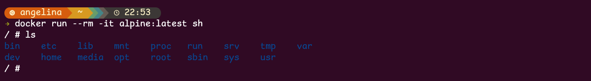

# Docker 简介

## 什么是 Docker ？

> 相信每一位程序员都经历过（甚至大部分时间都在经历）配环境的 **痛苦**。在开发的过程中，我们会频频遇到以下问题：
>
> - 依赖项冲突；
> - 所运行的程序可能会修改一些不希望被修改的本机系统文件，甚至对系统有害；
> - 软件开发过程中项目的频繁部署；
> - 无法复现其他人的运行环境。
>
> 如果你即将/已经成为一名程序员，相信你已经或多或少感受过以上令人头大的场景，于是聪明的你想到：既然我们已经可以把 **执行任务的代码** 打包成 **应用程序**，实现点击即用，那为什么不能把 **程序的运行环境** 也打包成某种东西（镜像），并通过某一载体（容器）来承载，从而也实现点击即用呢？
>
> 你可能听说过一种名为虚拟机的技术，这是一种典型的虚拟化技术，它可以在同一台物理机上，模拟出多个虚拟机，它们各自拥有自己的计算资源和操作系统，相互之间可以隔离开来。应用程序（连带其运行环境）会运行在某一虚拟机内部，不会对其他虚拟机产生影响。并且，只要将运行该应用程序的虚拟机打包，其他人获得副本后，就可以直接运行相应的程序。
>
> 听起来很好，很符合我们的需求，对吧？但是如果你真的接触过一些虚拟机产品，就会知道，虚拟机往往体积十分庞大（毕竟包含一整个操作系统），占用的计算机资源较多，运行速度慢，性能也并不理想。若为每个应用程序都配置一个虚拟机，将会面临巨大的硬件成本，这显然是不可行的。
>
> 再仔细想想，仅仅为了运行一个特定的应用程序，我们真的需要一套独立的计算资源和操作系统吗？肯定不是的。其实，应用程序只关心自己所处的软件环境中是否含有所需的所有依赖，至于这一软件环境处于何种操作系统内、操作系统如何调用计算资源，与应用程序并无直接关系。所以，我们只需要为每个应用程序都提供一个虚拟化的软件环境就可以了，即便它们运行在同一个操作系统上，又使用同一套计算资源。

我们所要介绍的 Docker，就是这样的一个 **轻量级** 虚拟化技术。它将应用程序运行在 **容器**（**Container**）中，容器直接运行在主机内核上，使用主机资源，并与外界（操作系统、其他容器）隔离，提供我们所需要的服务。

Docker 具有以下优势：

- **隔离与安全性**：Docker 容器与外界隔离，（在正确配置下）基本不会干扰外界环境，保护系统和应用的安全性；
- **环境一致性**：容器可以确保不同的合作开发者拥有完全相同的运行环境，避免出现无法复现其他人的运行环境的问题。
- **轻量化**：容器无需独立的操作系统，占用的硬件资源较虚拟机少了很多，大量容器同时运行时仍能保证一定的性能。

总结下来，Docker 其实就是一个基于虚拟化技术的、用于“打包”和“承载”应用程序运行环境的工具。

## Docker 的基本概念

### 镜像（Image）

我们所使用的操作系统，往往分为 **内核** 和 **用户空间**。Linux 内核启动后，会自动挂载 root 文件系统 `/`，以提供用户空间的支持。而 Docker 镜像就相当于一个 root 文件系统，只是包含了应用程序运行所需的所有东西。

《Docker 从入门到实践》中给出的对于镜像的定义：

> **Docker 镜像** 是一个特殊的文件系统，除了提供容器运行时所需的程序、库、资源、配置等文件外，还包含了一些为运行时准备的一些配置参数（如匿名卷、环境变量、用户等）。镜像 **不包含** 任何动态数据，其内容在构建之后也不会被改变。

镜像还有一个特性，就是 **分层存储**。其使用 `UnionFS`（联合文件系统）技术，将不同文件系统联合挂载到同一个目录下。所以镜像只是一个虚拟的概念（而不是像 `ISO` 一样的一个打包文件），它实际上并不是一个文件，而是一组文件系统的组合。同理，镜像构建也是一层一层完成的，每一层构建完就不再发生改变，后一层上的 **任何改变**（包括增加文件、**删除** 文件等）都只发生在自己这一层。

### 容器（Container）

要解释 **镜像和容器** 之间的关系，我们可以类比面向对象中 **类与实例** 的关系：**镜像** 就像一个 **类**，规定了运行应用程序所需的资源、配置等；而 **容器** 就像一个 **实例**，可以被创建和销毁等。在面向对象中，**类是静态的**，其定义不会被 **实例** 所修改，同理，**镜像也是静态的**，在 **容器** 中对环境进行修改（如增加依赖、修改环境变量等），并不会修改 **镜像** 的内容。

容器本质上是进程，但它（们）运行于独属于容器自己的 **命名空间**。因此容器可以拥有自己的文件系统、网络配置、进程空间、用户 ID 空间等，与宿主机中的其他进程隔离，就像自己在一个独立于宿主机的系统上操作一样。这种隔离带来了安全性的提升。

前面提到镜像是分层的，同样，容器也是分层的。容器运行时，以镜像为基础层，在其上构建一个自己的 **容器存储层**（可读可写），应用程序在镜像基础层和容器存储层叠加而成的文件系统中运行。

不难想到，容器存储层的生命周期与容器是一致的。也就是说，当容器消亡时，容器存储层也会消亡，其中的数据随之消失。因此我们说 **容器是易失的**（不能持久化存储数据）。要想持久化存储数据，可以使用 **数据卷** 或 **绑定宿主目录**。

### 仓库

镜像构建完成后，可以方便地在宿主机上运行，但如果我们想在其他主机上运行镜像，那么就需要 **存储和分发**，Docker Registry 就提供了这样的服务。

**注册服务**（Registry）将大量镜像分成多个多个 **仓库**（Repository），每个仓库包含多个 **标签**（Tag），每个标签对应一个 **镜像**（Image）。

假如我们需要一个 `Ubuntu` 镜像，已知其仓库的名字为 `ubuntu`，其中包含的标签有 `22.04`，`24.04` 等，表示不同的版本，那么我们可以使用 `ubuntu:24.04` 表示需要 `24.04` 版本的 `ubuntu` 镜像。如果未指定标签，比如使用 `ubuntu` 表示所需镜像，那么将会被默认为 `ubuntu:latest`，即最新版本的镜像。

Docker Registry 支持多用户环境，完整的仓库名多为 `用户名/软件名` 的形式，如 `yyy/ubuntu:22.04` 表示用户 `yyy` 的 Docker Hub 仓库中的镜像 `ubuntu`，版本为 `22.04`。若不包含用户名，则默认指向官方镜像仓库。

## Docker 的基本命令

### `docker build`

用于 **构建镜像**，用法为：

```bash
docker build <options> <path>
```

- `<options>`  是 `docker run` 命令可用的选项。
- `<path>` 指的是构建镜像的 **上下文目录**。

> `Docker` 在运行时分为 `Docker Engine` 和客户端工具。
>
> 我们在本地使用各种 `Docker` 命令时，实际上是在使用客户端工具，它与 `Docker Engine` 交互来完成各种功能。
>
> 在使用 `docker build` 进行构建时，该命令会将 `<path>` 下的所有内容打包上传给 `Docker Engine`，`Docker Engine` 展开这个上下文包，获得镜像构建所需的所有文件，完成构建过程。
>
> 所以，诸如 `COPY ../package.json .` 或 `COPY /usr/xxx .` 这样的命令是无法工作的，前者因为使用了上下文的父目录中的文件，后者因为使用绝对路径，它们对应的文件都超出了上下文的范围，无法被 `Docker Engine` 获得，构建也就无法完成。

| 选项                        | 作用                                       |
| --------------------------- | ------------------------------------------ |
| `-t <镜像名:标签>`          | 给镜像命名和打标签                         |
| `--file <文件名>`           | 用于指定构建使用的 `Dockerfile`            |
| `--no-cache`                | 构建镜像时不使用缓存，确保重新执行所有步骤 |
| `--build-arg <变量名>=<值>` | 传递构建参数给 `Dockerfile`                |

### `docker run`

用于 **基于镜像启动一个容器并运行** 它，用法为：

```bash
docker run <options> <image> <command> 
```

- `<options>` 是 `docker run` 命令可用的选项。
- `<image>` 表示创建容器使用的镜像。
- `<command>` 是创建容器后执行的命令。

> 执行命令后 **终止** 容器

| 选项                       | 作用                               |
| -------------------------- | ---------------------------------- |
| `-it`                      | 交互式终端，常用于 Linux 容器      |
| `-d`                       | 后台运行容器（detached mode）      |
| `-p <宿主端口>:<容器端口>` | 端口映射，使宿主机可以访问容器服务 |
| `--name <容器名>`          | 指定容器名称                       |
| `-v <宿主目录>:<容器目录>` | 挂载卷，实现数据持久化             |
| `--rm`                     | 容器退出后自动删除                 |
| `--network <网络名>`       | 指定容器使用的网络                 |

### `docker images`

用于 **列出当前已有的镜像**。

```bash
docker images
```

| 命令                                                | 作用                         |
| --------------------------------------------------- | ---------------------------- |
| `docker images -a`                                  | 显示所有镜像，包括中间层镜像 |
| `docker images <镜像名>`                            | 只显示指定镜像               |
| `docker images --digests`                           | 显示镜像摘要（digest）       |
| `docker images --format "{{.Repository}}:{{.Tag}}"` | 自定义输出格式               |


### `docker ps`

用于 **列出正在运行的容器**。

```bash
docker ps
```

| 命令                                           | 作用                            |
| ---------------------------------------------- | ------------------------------- |
| `docker ps -a`                                 | 显示 **所有容器**，包括已停止的 |
| `docker ps -q`                                 | 只显示容器 ID                   |
| `docker ps --filter "status=exited"`           | 筛选已退出的容器                |
| `docker ps --format "{{.Names}}: {{.Status}}"` | 自定义输出格式                  |


### `docker rmi`

用于 **删除镜像**。

```bash
docker rmi <镜像名或镜像ID>
```

### `docker rm`

用于 **删除容器**。

```bash
docker rm <容器名或容器ID>
```

### `docker pull`

用于 **拉取远程镜像**。

```bash
docker pull <镜像>
```

### `docker push`

用于 **上传镜像到仓库**。

```bash
docker push <镜像>
```

### `docker commit`

用于 **把容器当前状态保存为一个新的镜像**。

```bash
docker commit [OPTIONS] CONTAINER [REPOSITORY[:TAG]]
```

- `CONTAINER` → 容器 ID 或容器名

- `REPOSITORY[:TAG]` → 新镜像的名字和标签

## 如何使用 Docker？

### Linux 安装 Docker

- **安装 Docker**

  ```bash
  sudo apt install docker.io
  ```

- **启动 Docker 服务**

  ```bash
  sudo service docker start
  ```

- **将当前用户加入 Docker 用户组，避免每次都使用 `sudo`**

  ```bash
  sudo usermod -aG docker $USER
  ```

- **创建 Docker 配置目录**

  ```bash
  sudo mkdir -p /etc/docker
  ```

- **编辑 `daemon.json`**

  ```bash
  sudo nano /etc/docker/daemon.json
  ```

- **重启 Docker 服务，使配置生效**

  ```bash
  sudo service docker restart
  ```

- **查看 Docker 信息**

  ```bash
  docker info
  ```

- **测试拉取镜像**

  ```bash
  docker pull hello-world
  ```

### 使用已有的镜像

- **创建一个容器，并开启交互模式，分配伪终端，且在容器运行结束后删除该容器。**

    ```cmd
    docker run --rm -it alpine:latest sh
    ```
    
    > **Alpine** 指的是 **Alpine Linux**，它是一个非常轻量、简洁、安全的 Linux 发行版。
    >
    > - 更新包管理器索引：`apk update apk` 
    >
    > - 安装软件：`add curl bash vim`
    > - 退出容器：`exit`
    
    

### `Dockerfile` 简介

`Dockerfile` 是一种脚本文件，下面是一些常用的命令。

- **`FROM <image>`**

用于指定基础镜像，我们的定制镜像就在基础镜像之上构建，比如：

```dockerfile
FROM ubuntu:22.04 
```

表示使用版本为 `22.04` 的 `ubuntu` 镜像来定制我们的镜像。

- **`RUN <command>`**

用于在镜像构建时执行命令，是 `Dockerfile` 中最常用的指令之一，用法也十分简单，比如：

```dockerfile
RUN echo -e "hello world!" > test.txt 
```

表示向文件 `test.txt` 中写入内容 `hello world!`。

- **`WORKDIR <dir_path>`**

设置工作目录，后续命令相对于该目录，若指定目录不存在会自动创建。比如:

```dockerfile
WORKDIR /app 
```

表示将工作目录设定为 `/app`。

> **注意** :
>
> `WORKDIR` 会修改 **以后各层** 的工作目录，而 `RUN cd /app` 仅会修改 **当前层** 的工作目录，对后面的层没有影响。

- **`COPY <src_paths> <dest_path>`**

用于复制文件。该指令将 **构建上下文目录** 中 `<src_paths>` 的文件/目录复制到 **新一层** 镜像的 `<dest_path>` 位置，比如:

```dockerfile
COPY package.json config.json /usr/src/app/ 
```

表示将 **构建上下文目录** 中的 `package.json` 和 `config.json` 两个文件复制到 **新一层镜像** 内的 `/usr/src/app/` 目录下。

- **`ENV <key1>=<value1> <key2>=<value2> ...`**

用于设置环境变量，其后的 `RUN` 等命令和所运行的应用都可以使用设定好的环境变量。

```dockerfile
ENV <key> <value> 
```

- **`EXPOSE <ports>`**

用于 **声明** 容器暴露的端口，主要用处是帮助镜像使用者理解这个镜像服务打算使用什么端口，方便配置端口映射。

```bash
EXPOSE <ports>
```

> **注意:**
>
> 这只是一个 **声明**，并未自动进行端口映射，仍需运行时使用 `-p <host_port>:<container_port>` 进行端口映射。

- **`CMD <command>`**

容器 **启动时默认执行的命令**，可以被 `docker run <image> <command>` 中提供的命令替换。

```bash
CMD <command>
```

### 定制自己的镜像

如果每次有一个新的 C++ 项目，都要从干净的 `Ubuntu` 镜像出发配置环境，显然是十分耗费精力的，并且也无法发挥 Docker 的优势。此时我们就需要 **定制镜像**，这时就需要使用 `Dockerfile` 了。

- **确定基础镜像，此处可以使用最新版本的 `ubuntu` 镜像**

    ```dockerfile
    FROM ubuntu 
    ```

- **设定一个工作目录（若不设定则默认处在根目录 `/` 下）**

    ```dockerfile
    WORKDIR /usr/src/cpp 
    ```

- **为了避免安装时可能跳出交互式时区选择导致构建过程卡住，我们可以设置环境变量**

    ``` dockerfile
    ENV DEBIAN_FRONTEND = noninteractive 
    ```

- **需要安装 C/C++ 的编译工具，所以执行**

  - `Docker` 镜像具有 **分层存储** 的特性，而 `Dockerfile` 中的 **每一行** 命令，都会建立一个新的层。

      利用 `&&` 尽量减少镜像层数

    ```dockerfile
    RUN apt update && apt install build-essential 
    ```

- **创建一个 C++ 文件，并写入一段简单的输出 `Hello world!` 的代码**

    ```dockerfile
    RUN echo "#include <iostream>" > main.cpp
    RUN echo "int main() {" >> main.cpp
    RUN echo "\tstd::cout << \"Hello world!\" << std::endl;" >> main.cpp
    RUN echo "\treturn 0;" >> main.cpp
    RUN echo "}" >> main.cpp
    ```

- **更通用性的做法，将已有的 `main.cpp` 直接复制过来**

  ```dockerfile
  COPY ./main.cpp .
  ```

- **编译这个 C++ 源代码文件**

    ``` dockerfile
    RUN g++ main.cpp -o main 
    ```

- **运行可执行文件 `main`，即可完成任务，我们将其作为容器的启动命令**

    ``` dockerfile
    CMD ["./main"] 
    ```

- **这样，我们就完成了一个 `Dockerfile`，整体如下：**

    ``` dockerfile
    FROM ubuntu
    
    WORKDIR /app
    
    ENV DEBIAN_FRONTEND=noninteractive
    
    RUN apt update && apt install build-essential 
    
    COPY . .
    
    RUN g++ main.cpp -o main
    
    CMD ["./main"]
    ```

- **利用这个 `dockerfile` 构建镜像**

    ``` bash
    docker build -t cpp: 1.0 . 
    ```

- **创建一个容器并运行它**

    ``` bash
    docker run --rm cpp: 1.0 
    ```

若看到 `Hello world!` 的输出，证明我们写好的 `Dockerfile` 是有效的。

> 实际上，Docker Hub 中有 `gcc` 镜像，可以直接用于 C++ 文件的编译
>
> 这里使用 `dockerfile` 构建镜像是为了帮助理解镜像构建

### 多阶段构建镜像

在构建 Docker 镜像时，通常存在两个问题：

1. **镜像体积大**：构建时会安装编译工具、依赖等，最后的镜像包含很多无用内容。
2. **安全性差**：编译环境与运行环境混在一起，增加攻击面。

**多阶段构建** 的目标就是：

> 在一个 `Dockerfile` 中使用多个阶段，前面的阶段用于构建、编译，后面的阶段只复制运行所需的文件，从而得到干净、体积小的最终镜像。

这里直接给出修改后 `Dockerfile` 的代码。

``` dockerfile
# build
FROM ubuntu AS builder

WORKDIR /app

ENV DEBIAN_FRONTEND=noninteractive

RUN apt update && apt install -y build-essential

COPY . .

RUN g++ src/main.cpp -o main

# runtime
FROM ubuntu AS runtime

WORKDIR /app

COPY --from=builder app/main .

CMD ["./main"]
```

> 其中 `FROM` 语句中多了 `AS xxx`，这是一种给构建阶段命名的方法。
>
> 而在 `COPY` 语句多了一个 `--from=builder` 参数，它表示的是从 `builder` 阶段的镜像中复制文件，所以此时的文件源路径 `app/main`，不再是宿主机内的，而是 `builder` 阶段的镜像内的。
>
> 此外，还可以将第二阶段的基础镜像改为 `scratch` 镜像，这是一个完全空的镜像，不包含任何文件系统，这意味着它拥有更小的体积。
>
> 由于 `scratch` 镜像中也不包含 C++ 的动态链接库，所以我们需要在编译命令中添加 `-static` 选项静态链接标准库。


## 数据管理

容器是易失的，不能持久化存储数据。但有些时候，我们有持久化存储数据的需求。

比如在软件开发中，后端代码更新后，需要重新构建镜像，并创建新的容器，此时原来容器中的数据就丢失了。

我们并不希望如此，Docker 也提供了 **数据卷** 和 **挂在主机目录** 两种方式来避免这一问题。

### 数据卷

**数据卷** 是一个可供 **一个或多个容器** 使用的特殊目录，它可以绕过 Docker 的联合文件系统，因此有以下特性：

- 可以在容器间共享；
- 对其修改会立即生效；
- 对数据卷的更新不会影响镜像；
- 数据卷会默认一直存在，即使容器被删除。

#### 创建数据卷

- **创建一个名为 `<vol_name>` 的数据卷。**

``` bash
docker volume create <vol_name> 
```

- **查看所有的数据卷**。

``` bash
docker volume ls 
```

- **查看指定数据卷的信息**。

``` bash
docker volume inspect <vol_name> 
```


#### 为容器挂载数据卷

在使用 `docker run` 命令时，可以增加 `--mount` 选项来挂载一个数据卷，比如

``` bash
docker run --name web_backend \
    --mount source = database, target =/app/database \
    backend
```

表示用镜像 `backend` 创建一个新的容器，并将先前创建的数据卷 `database` 挂载到容器 `web_backend` 的 `/app/database` 目录下。

#### 查看数据卷信息

使用 `docker run` 命令，查看容器的信息。

``` bash
docker inspect <container_name> 
```

其中 `Mounts` 字段的内容就是该容器挂载的数据卷

``` json
"Mounts": [
    {
        "Type": "volume",
        "Name": "database",
        "Source": "/var/lib/docker/volumes/database/_data ",
        "Destination": "/app/database",
        "Driver": "local",
        "Mode": "z",
        "RW": true,
        "Propagation": ""
    }
],
```

#### 删除数据卷 

可以使用 `docker volume rm` 来删除一个已创建的数据卷。

``` bash
docker volume rm <vol_name> 
```

> 注意，数据卷是用于持久化存储数据的，所以并 **不会在容器消亡时被自动删除**。

### 挂载主机目录

与挂载数据卷类似，挂载主机目录只是不再需要创建数据卷，而是直接使用本机中的目录作为持久存储的空间。挂载主机目录同样适用 `--mount` 选项，比如

``` bash
docker run --name web_backend \
    --mount type = bind, source =/usr/apps/web_database, target =/app/database \
    backend 
```

其中使用 `type=bind` 表示挂载主机目录（实际上，挂载数据卷是 `type=volume`，只不过可以省略）。

> 挂载主机目录时，本地目录 **必须使用绝对路径**。
>
> 挂载主机目录的默认权限是 **读写**，还可以通过增加 `readonly` 选项指定为 **只读**

实际上，不只有主机目录可以被挂载，主机文件也可以被挂载，比如

``` bash
docker run --name web_backend \
    --mount type = bind, source =/usr/apps/web_app/.env, target =/app/.env, readonly \
    backend 
```

就可以用于挂载一个配置文件。

此外，每个容器可以有多个挂载项，比如

``` bash
docker run --name web_backend \
    --mount source = database, target =/app/database \
    --mount type = bind, source =/usr/apps/web_database, target =/app/database \
    --mount type = bind, source =/usr/apps/web_app/.env, target =/app/.env, readonly \
    backend
```

就可以同时挂载多个不同的主机目录/数据卷。

## Docker Compose

在前面的介绍中，我们已经学会了使用 `Dockerfile` 来方便地定义一个应用容器。但是，一个项目往往是由多个应用组成的，这时，运行项目就需要输入多条 `Docker` 命令，并且在需要进行数据卷挂载、容器间通信时更为糟糕。我们需要一种更为简单的方式来快速运行多个容器，`Compose` 就提供了这样的服务。

Compose 是一个用于实现 **容器集群快速编排** 的工具，它使用 `YAML` 文件配置项目容器集群，并通过 `docker compose` 实现项目的快速启动。

我们可以使用 `Docker-Compose.yml` 文件来配置一组容器，如下面的示例

``` yaml
volumes:
  db:

services:
  backend:
    build: .
    ports:
      - "8000:80"
    volumes:
      - "/usr/apps/web_app/config.json:/app/config.json: ro"
    restart: unless-stopped

  database:
    image: mysql
    volumes:
      - "db:/var/lib/mysql"
    environment:
        MYSQL_ROOT_PASSWORD: "my_password"
        MYSQL_DATABASE: web_app 
```

与上面的 `Docker-Compose.yml` 功能类似的 Docker 命令：

``` dockerfile
docker volume create db
docker run --name database \
    -e MYSQL_ROOT_PASSWORD = "my_password" \
    -e MYSQL_DATABASE = web_app \
    --mount source = db, target =/var/lib/mysql \
    mysql
docker build -t backend .
docker run --name backend \
    -p 8000:80 \
    --mount type = bind, source =/usr/apps/web_app/config.json, target =/app/config.json, readonly \
    backend
```

还有一处细节，`restart: unless-stopped` 表示的是容器不断重启（除非手动停止），直到启动成功为止。采用这一选项是因为我们不确定后端和数据库启动的先后顺序，但我们的后端需要等待数据库初始化完成后才能正常运行。

现在，我们可以使用如下的命令来一键控制容器集群（即整个项目）的启动、停止：

- `docker compose up`，启动所有容器；
- `docker compose down`，停止所有容器；
- `docker compose logs <service_name>`，查看服务日志；
