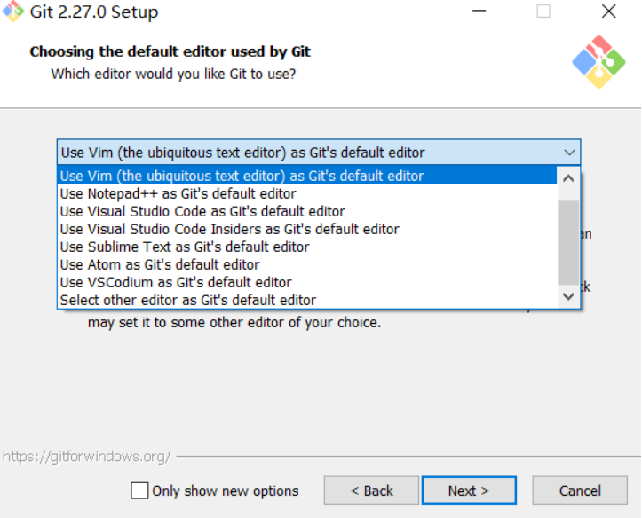
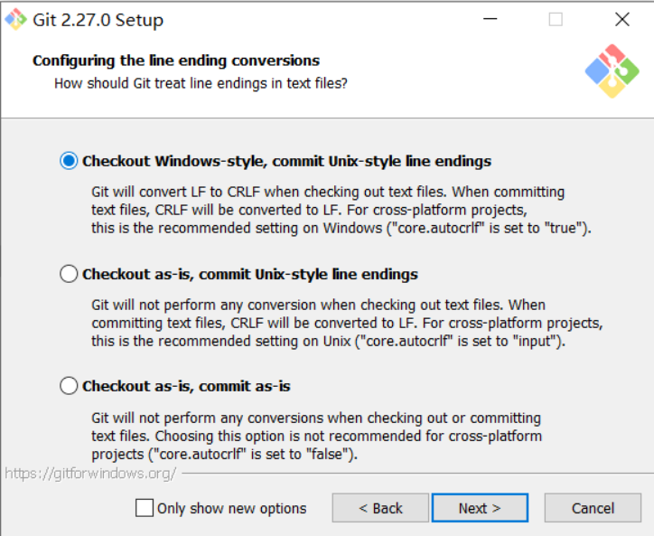
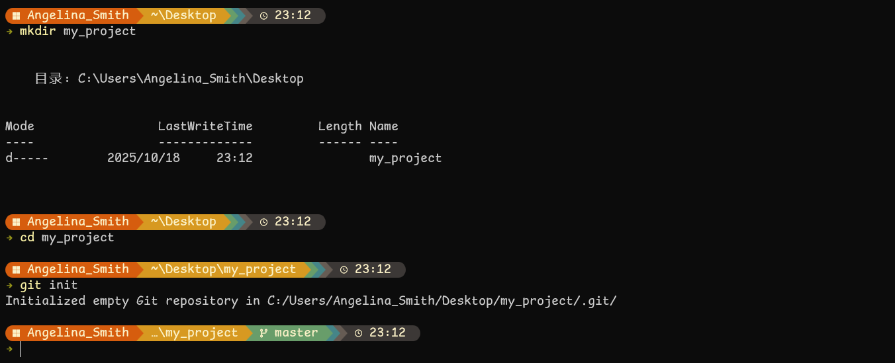
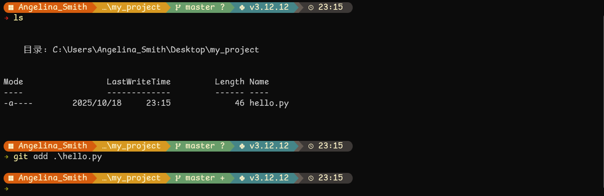
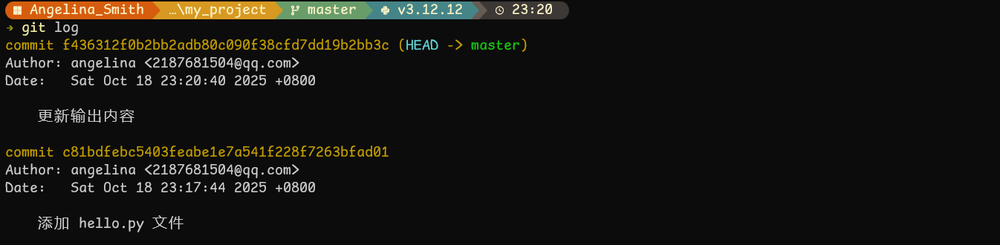
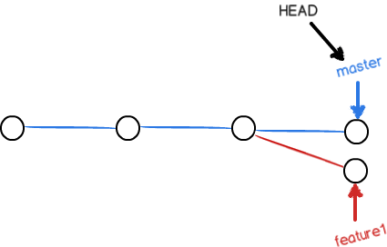

# Git 简介

## 什么是 Git？

Git 是一个 **分布式版本控制系统**。

在代码开发过程中，总会遇到一些问题。代码不知道改了哪里不能运行了，想要回退怎么办？多个人同时想对代码进行修改（并行开发），开发完后怎么合并？显然，有一个能帮助我们解决这些问题的工具将极大的加快我们开发的速度。而这种工具，便是版本控制软件。

版本控制软件帮助使用者找出：

- 不同版本之间的差异
- 谁做出了这个修改
- 什么时候做出了这个修改
- 做出修改的人给出的修改理由

`Git` 是 `Linux` 之父 `Linus Torvalds` 为开发 `Linux` 内核而建立的一个 **分布式版本控制软件**。

`Git` 除了版本控制软件本身的优势以外，还可以：

- 通过查看 `git history`，开发者可以看到一个项目开发的时间线
- 通过 `git branch`（分支），开发者可以在不用担心影响主代码的情况下进行开发

> 什么是分布式的版本控制软件呢？为了了解清楚，我们需要区分 **中央版本控制系统** 和 **分布式版本控制系统** 的区别。
>
> 中央版本控制系统必须同时存在服务端和客户端。当进行代码备份时，客户端会向服务端发出请求，并将此次修改的内容发送到服务器当中去，服务端收到请求后，会将代码存储在服务器当中；同样当客户端想查看某一个版本的修改内容或者想恢复到某一个版本之时，客户端也会发送请求到服务端，服务在端接收到请求之后会做出相应的处理并返回给客户端。也就是说，在业务流程过程中，服务端必须存在，**所有请求必须经过服务端的处理**。
>
> 分布式版本控制器，主要是将备份的代码以及记录 **完全独立在本地存储**。比如说当你想将代码恢复到某一个版本的时候，本地版本控制器 **不需要依赖网络** 便可以完成此操作，因为本地版本控制器拥有 **完整独立的一套控制系统**。

## 如何安装 Git？

### Windows

- **下载**

- 安装包下载地址：<https://gitforwindows.org/>

- 国内镜像：<https://npm.taobao.org/mirrors/git-for-windows/>

- 清华镜像（校内访问较快）：<https://mirrors.tuna.tsinghua.edu.cn/github-release/git-for-windows/git/>

- **编辑器**

Git 需要绑定文本编辑器使用，自带支持以下编辑器：`Nano`、`Vim`、`Notepad++`、`VS Code`、`Sublime` 等。



- **换行符**

对于换行符，在 `Windows` 中，默认的换行是 `CRLF`，但实际开发时，通常会发现大家一致使用 `LF`。

> - **`LF` (Line Feed)** 就是只有换行，不回到行首。
> - **`CRLF` (Carriage Return + Line Feed)** 是先回车，再换行。
>
> - 不同系统的历史遗留选择
>   - Unix / Linux / macOS（现代）：**使用 `LF` (`\n`)。**
>     因为 Unix 在设计时选择了更简单的方案——只要“下一行”就够了
>   - Windows **：使用 `CRLF` (`\r\n`)。**
>     源于早期的打字机和旧操作系统，它们在换行时确实需要“先回车再走纸”。微软的系统延续了这种做法。

对于安装过程中换行符的配置，这里 Checkout 表示从仓库中拉取的代码是以什么换行符结尾，Commit 表示你提交的代码是以什么换行符结尾，as-is 是说换行符保持原样。



我们推荐的选项是根据今后的应用场景来选择。如果团队中既有 `Windows` 选手又有 `Linux` 选手，那么我们可以选择第三项（即改动最小原则，我们并不想因为 `Commit` 时换行符的问题覆盖掉其他开发者的贡献）。当然如果团队中的各位做过约定，大家统一以 `LF` 为换行符为结尾开发，提交的代码也只能是 `LF` 结尾，那么我们就可以选择第一项或者第二项。

注意，这个设置我们推荐默认选择第三项，然后对于有需要的项目分别配置：

```bash
git config core.autocrlf true/input/false
```

其中 `true`, `input`, `false` 分别对应第一，第二，第三项。

验证是否成功：

```bash
git --version
```

### `Debian/Ubuntu`

```bash
apt-get install libcurl4-gnutls-dev libexpat1-dev gettext
apt-get install git
```

### `Centos/RedHat`

```bash
yum install curl-devel expat-devel gettext-devel
yum install git-core
```

### `Mac`

一般 Mac 平台是自带 Git 的。如果实在没有在 Mac 平台上安装 Git 最容易的当属使用图形化的 Git 安装工具 [下载地址](http://sourceforge.net/projects/git-osx-installer/)。

也可以用 `Homebrew` 安装。

```bash
brew install git
```

### 配置 Git

使用如下命令可以配置自己在 git 中的用户名和邮箱，你也可以通过 `git config` 命令按自己的喜好配置更多东西。

```bash
git config --global user.name <name>
git config --global user.email <email-address>
```

查看当前配置：

```bash
git config --list
```

## 如何使用 Git？

### 基础操作

- **Git 的三个区域**

  - **工作区（Working Directory）**：你正在编辑的文件（比如 `main.c`）。
  - **暂存区（Staging Area）**：你告诉 Git “我打算提交这些文件” 的地方。
  - **仓库（Repository）**：Git 已经正式保存的版本历史（每次提交叫一个 _commit_ ）。

- **初始化仓库**

  创建一个新文件夹作为你的第一个 `Repo`，进入该文件夹，输入 `git init`，以使用 Git 来管理这个文件夹。

  ```bash
  git init
  ```

  

- **添加文件**

  在这个文件夹中添加文件，使用 `git add test.py` 将文件到目前为止的修改放入 Git 的暂存区。

  

  一次性添加工作环境目录下的所有文件，使用 `git add .`。

  ```bash
    git add .
  ```

- **查看状态**

  通过 `git status`，我们可以查看现在的文件 git 状态。

  ```bash
  git status
  ```

- **记录修改**

  当所有的修改都用 `git add` 加入到暂存区后，就使用 `git commit –m "..."` 将所有的暂存区里的修改提交至本地仓库，省略号处填写这次版本迭代都干了什么。

  ```cmd
  git commit -m "modify xxx"
  ```

  

- **版本迭代**

  每当我们修改了文件再次执行 `git add .`、`git commit –m "..."` 提交更改。

  

- **查看历史**

  通过 `git log`，我们可以查看之前的 `Commit` 记录，以及对应的 `SHA` 编码。

  ```bash
  git log
  ```

  

- **版本回退**

  首先，我们必须指定要回退到的版本。而指定版本有两种方式。

  1. 相对寻址。在 Git 中，用 `HEAD` 表示当前版本，也就是最新的提交 `f43631...`（注意不同工程，不同次 Commit 的版本 ID 肯定不同），上一个版本就是 `HEAD^`，上上一个版本就是 `HEAD^^`，当然往上 100 个版本写 100 个 `^` 比较容易数不过来，所以写成 `HEAD~100`。
  2. ID 寻址。如上述 `"modify test.py"` 这个版本，可以用版本 `SHA ID` 的前几个字符来表示（只要没有歧义即可），比如 `c81bdf`。

  而了解了怎样指定版本后，我们便可以使用 `git reset --hard <Version>` 来恢复到之前的版本了。

  ```bash
  git reset --hard <Version>
  ```

- **工作区，暂存区与分支的概念**

  工作区（英文：Working Directory）指你电脑上存储的当前项目文件（最新），版本库（英文：Repository）中存了很多东西，其中最重要的就是暂存区，还有 Git 为我们自动创建的第一个分支（英文：Branch）`master`，以及指向 `master` 的一个指针叫 `HEAD`。

  `git add` 命令实际上就是把要提交的所有修改放到暂存区（英文：Stage），然后，执行 `git commit` 就可以一次性把暂存区的所有修改提交到分支。

  

### 同步开发

- **分支**

> 分支（**branch**）让你在同一个项目里 **同时存在多个平行世界**——每个世界都有自己独立的代码进度、实验方向和历史记录。
>
> 分支在实际中有什么用呢？假设你准备开发一个新功能，但是需要两周才能完成，第一周你写了 50% 的代码，如果立刻提交，由于代码还没写完，不完整的代码库会导致别人不能干活了。如果等代码全部写完再一次提交，又存在丢失每天进度的巨大风险。
>
> 现在有了分支，就不用怕了。你创建了一个属于你自己的分支，别人看不到，还继续在原来的分支上正常工作，而你在自己的分支上干活，想提交就提交，直到开发完毕后，再一次性合并到原来的分支上，这样，既安全，又不影响别人工作。

- **创建与合并分支**

我们可以将项目的进展理解成一条时间线，这条时间线就是一个分支，而项目的主进程线，则是 `master` 分支。我们之前提到的指针 `HEAD`，事实上是指向当前分支头部的指针：


每次提交，`master` 分支都会向前移动一步，这样，随着你不断提交，`master` 分支的线也越来越长。

现在我们使用命令 **创建新的分支 `dev` 并切换过去**。

```bash
git branch dev      # 创建分支 dev
git checkout dev    # 切换到 dev 分支
```

```bash
git checkout -b dev # 创建分支 dev 并切换到该分支
```

Git 新建了一个指针叫 `dev`，指向 `master` 相同的提交，再把 `HEAD` 指向 `dev`，就表示当前分支在 `dev` 上：


我们可以使用 `git branch` 命令来 **查看所有分支**，在结果中，当前分支前面会多出一个 `*` 号。

```bash
git branch
```

从现在开始，对工作区的修改和提交就是针对 `dev` 分支了。

比如新提交一次后，`dev` 指针往前移动一步，而 `master` 指针不变：


假如我们在 `dev` 上的工作完成了，就可以把 `dev` 合并到 `master` 上。怎么 **合并分支** 呢？

首先我们要搞清楚，是谁要合并谁。这里我们应该理解成，`master` 要吃掉新建的 `dev` 分支，成为新的 `master`。

于是，首先我们应该切换回 `master` 分支，使用命令 `git checkout master`，以表明这是 `master` 分支的操作。

然后，我们可以使用 `git merge dev`，进行分支合并。

```bash
git checkout master
git merge dev
```

最后，我们可以通过 `git branch -d dev`，将 `dev` 分支删除。

```bash
git branch -d dev
```

[](https://camo.githubusercontent.com/c13b6a439ca841691e0da5975e005f6486738a6ad1ad2bbd37792705aa6095e0/68747470733a2f2f73322e6c6f6c692e6e65742f323032322f30322f30372f63723654704a5158695338796a4e452e706e67)

- **解决冲突**

假设出现这么一种情况，`master` 分支和新建的 `feature1` 分支均提交了新的更改，那么我们该怎么将其 Merge 呢？



这种情况下，我们尝试用 `master` 去 Merge `feature1` 的时候，控制台便会提醒我们产生合并冲突。必须手动解决冲突后再提交。而我们根据提示信息去寻找对应的冲突文件，在冲突处 Git 也会将其显著的标出，例如：

```bash
Git is a distributed version control system.
Git is free software distributed under the GPL.
Git has a mutable index called stage.
Git tracks changes of files.
<<<<<<< HEAD
Creating a new branch is quick & simple.
=======
Creating a new branch is quick AND simple.
>>>>>>> feature1
```

在这里我们手动修改后，再重新使用 `git add` 和 `git commit` 就可以成功将两个分支合并了。

特别的，在分支合并之后，使用 `git log --graph` 可以看到分支合并图。

> **`Rebase`**
>
> 感觉版本树因为合并冲突，产生了环形结构，于是很不爽？`git rebase` 可以帮助你将版本树恢复线性。
>
> ```bash
> git rebase
> ```

### 远程 Git 仓库

显然，大家不会都挤在你的电脑上开发。我们记得，Git 是分布式的版本控制软件。于是，我们需要一种方式进行同步。

例如，把 Git 仓库放在网上。在这里我们介绍几种远程的 Git 仓库：

- `GitHub`：全球最大同性交流网站。一个基于 Git 的代码托管服务平台，开源社区交流代码的重要网站。
- `GitLab`：类似 `Github`，但主要面向企业、组织等内部合作。

下面我们介绍一些在远程仓库控制时的基本操作：

- **克隆仓库到本地**

比如，以 `github` 的 Git 仓库为例。我们使用 `git clone xxx.git`，这样便把远程仓库中的内容取到了本地，并创建了工作区。

```bash
git clone git@github.com:SAST-skill-docers/sast-skill-docs.git
```


- **添加远程仓库地址**

有时，我们的项目是使用 `git init` 来创建的，并不是从 `GitHub` 上直接 Clone 的别人的代码。

这时我们要首先在 `GitHub` 上新建一个 `Repo`，然后按照提示，添加远程仓库。

```bash
git remote add origin <你的 Repo 的 HTTP/SSH 地址>
```


这样便是告诉本地的 Git 管理器，给 `Repo` 的 `HTTP/SSH` 地址起一个名字叫做 `origin`，方便今后使用。

```bash
git remote add origin <你的 Repo 的 HTTP/SSH 地址>
```

查看是否添加成功:

```bash
git remote -v
```

- **推送更改**

早期 Git 默认主分支名是 `master`，现在（尤其是 `GitHub`）默认分支名改成了 `main`。

为确保你的本地分支名和 `GitHub` 的主分支一致，避免推送出错，重命名当前分支为 `main`。

```bash
git branch -M main
```

把本地的 `main` 分支 **推送** 到远程仓库 `origin`。

```bash
git push origin main
```

`-u`：告诉 Git “以后我默认用这个远程分支”。

之后只需输入 `git push` 或 `git pull` 就可以推送/拉取 `origin/main`。

```bash
git push -u origin main
```

- **拉取更改**

从远端 `origin` 的 `master` 获取其最新的数据（可能是别人更新上去的）。

```bash
git pull origin master
```

正常的推送更改流程为：先 `add` 和 `commit` 本地修改，然后拉取远端更改，如果此时出现了合并冲突（`Merge Conflict`），解决合并冲突。然后，在合并冲突解决后推送更改。

> 如果校园网屏蔽了常规的 SSH 端口 22，你可以尝试使用 GitHub 提供的 **SSH 端口 443**。GitHub 为此提供了一个特殊的 URL，允许你通过端口 443 进行 SSH 连接。
>
> **步骤：**
>
> - 更改 Git 的远程仓库 URL 为 GitHub 的 SSH 地址，使用端口 443：
>
>   ```bash
>   git remote set-url origin ssh://git@ssh.github.com:443/username/repo.git
>   ```

### Git LFS

`Git` 的逻辑是存储 `diff`。但对于二进制大文件, 尤其是图片, 视频, 模型等, `Git` 无法给出正确的 `diff`, 从而会倾向于把整个文件删掉重新上传。

那么: 如果你有一个模型, 这个模型有 `100MB`, 你每次微调了一点, 调了 `10` 次, 这时候你的 `Git` 仓库就有 `1GB` 了. 其他人在 Pull / 你在其它设备上 Pull 的时候就要下载完整的 `1GB` 数据 (即便你并不需要之前的 9 个版本). 对一个体量更大的项目, 这就会变得不可接受了. (你也不想为了一个 `100MB` 的项目下载 `10GB` 的东西吧)

因此, `Git LFS` (Large File Storage) 被开发出来以解决这一问题。

`LFS` 的基本原理是把仓库里的文件换成一个指向 LFS 服务器的 "指针", 然后在需要的时候再下载这个文件。

`LFS` 在 `Linux` 下一般是一个单独的包 `git-lfs`. 安装之后就可以用 `git lfs init` 初始化 `LFS`。

此时 `LFS` 给 `Git` 挂了一些钩子, 使得所有被 `git lfs track` 的文件都会随着 Git 的 Push / Pull 被上传 / 下载到 `LFS` 服务器上。

### Git Ignore

在 Git 仓库中, 绝大多数时间里都会有一些并不需要上传的文件, 不管是训练模型的输出, 编译生成的程序, `IDE` 的配置, 测试数据库等等。**一定记得把这些文件加入到 `.gitignore` 文件中.** 这个文件会告诉 Git 哪些文件不需要被上传。

### GitHub SSH 配置

登录您的 **GitHub 账户**。

点击右上角的头像，选择 **Settings**（设置）。

在左侧导航栏找到 **SSH and GPG keys**。

点击 **New SSH key** (新增 SSH 密钥)。

**Title (标题):** 给您的密钥取一个易于识别的名称（例如：`Angelina_WSL_Laptop`）。

**Key (密钥):** 将您在`ssh_kengen`的**公钥内容**粘贴到这个文本框中。

点击 **Add SSH key** 完成添加。
